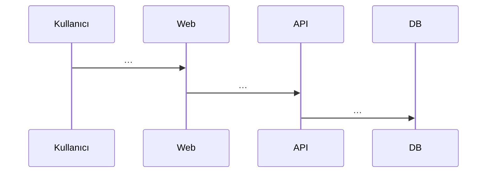
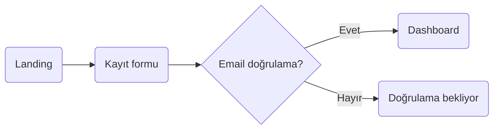

<!--
========================================================================
 PROJE RAPORU ŞABLONU — BMU1208 Web Tabanlı Programlama
 Bitlis Eren Üniversitesi — Dr. Öğr. Üyesi Davut ARI
========================================================================

 Bu dosya final proje raporunuzun ana iskeletidir. Toplam 12 bölüm var.
 HER BÖLÜMÜ doldurun. Boş bırakılan bölümler puan kaybı getirir.

 Placeholder kuralları:
   {{...}}        → Doldurulacak değişken alan
   [...]          → Sizin yazacağınız açıklama
   TODO:          → Yapılacak iş, silin
   (Rehber: XX)   → İlgili rehber dosyasına gidin (00-REHBER/)

 Yazım stili:
   - Cümleler kısa ve somut olsun.
   - "Hızlı" ≠ "P95 < 300ms"; sayı kullanın.
   - Her iddianın bir kaynağı olsun (link, kullanıcı alıntısı, veri).
   - Markdown formatı kullanın; kod blokları ```tr```.

 Başarılar!
========================================================================
-->

# C# .NET Core İK API

> **Proje Kodu:** P30 · **Zorluk:** Zor · **Puan:** 55 · **Hafta:** 3

**Öğrenci:** SEMANUR YILDIRIM  
**Öğrenci No:** 23080410007  
**E-posta:** semanuryildirim.03@gmail.com  
**Ders:** BMU1208 Web Tabanlı Programlama — *Dr. Öğr. Üyesi Davut ARI*  
**Kurum:** Bitlis Eren Üniversitesi — Mühendislik-Mimarlık Fakültesi — Bilgisayar Mühendisliği  
**Dönem:** 2025-2026 Bahar  
**Son Güncelleme:** 16.04.2026

---

## İçindekiler

1. [Proje Künyesi](#1-proje-künyesi)
2. [Executive Summary](#2-executive-summary)
3. [Problem ve Motivasyon](#3-problem-ve-motivasyon)
4. [Hedef Kitle ve Persona](#4-hedef-kitle-ve-persona)
5. [Ürün Gereksinimleri (PRD)](#5-ürün-gereksinimleri-prd)
6. [Piyasa ve Rekabet Analizi](#6-piyasa-ve-rekabet-analizi)
7. [Teknoloji Yığını (Tech Stack)](#7-teknoloji-yığını-tech-stack)
8. [Sistem Mimarisi](#8-sistem-mimarisi)
9. [Veri Modeli ve API Tasarımı](#9-veri-modeli-ve-api-tasarımı)
10. [UI/UX Tasarımı](#10-uiux-tasarımı)
11. [Güvenlik, Performans, Test](#11-güvenlik-performans-test)
12. [Maliyet, Gelir Modeli, GTM](#12-maliyet-gelir-modeli-gtm)
13. [Ek: Post-Launch Review](#13-ek-post-launch-review)

---

## 1. Proje Künyesi

| Alan | Değer |
|------|-------|
| Proje Adı | C# .NET Core İK API |
| Proje Kodu | P30 |
| Slogan (1 cümle) | [*örn. "Bir HTML dosyası kadar hafif, bir mağaza kadar güçlü"*] |
| Kategori | [*örn. E-ticaret / Productivity / Finance / Education / …*] |
| Hedef Platform | Web (responsive) · [Mobile web · PWA · Desktop (Tauri)] |
| GitHub | https://github.com/KULLANICI_ADI/final-p30-c-net-core-ik-a |
| Canlı Demo | https://c-net-core-ik-api.vercel.app |
| Demo Kullanıcı | Email: `demo@example.com` · Şifre: `demo123` |
| Lisans | MIT |
| Başlangıç | 2026-04-15 |
| Hedef Bitiş | 2026-06-15 |
| Durum | 🟡 Development / 🟢 Launched / 🔵 Maintenance |

### Varsayılan Tech Stack (özet)

| Katman | Teknolojiler |
|--------|--------------|
| Framework | .NET 9, ASP.NET Core Web API, Minimal API |
| Database | PostgreSQL 16 + Entity Framework Core 9 |
| Auth | Identity + JWT |
| Validation | FluentValidation |
| PDF | QuestPDF (bordro) |
| Test | xUnit + Testcontainers |
| Deployment | Docker + Azure App Service / Railway |

> Detaylar için Bölüm 7.

---

## 2. Executive Summary

*3 paragraf, toplam ~200-300 kelime. Bir yatırımcı / işe alım mülakatında 2 dakikada anlatacak özet.*

### 2.1 Ne Yapıyoruz?

[*Ürünün adı + kime hizmet ettiği + ana değeri. 2-3 cümle.*]

> Örnek: *"FlashCart, küçük Türk markaları için tamamen ücretsiz, Alpine.js tabanlı minimal e-ticaret çözümüdür. Shopify'ın $29/ay başlangıç ücretini ödemek yerine, kullanıcı bir statik hosting'e deploy edip aynı gün satışa başlar."*

### 2.2 Neden Şimdi?

[*Trend, piyasa koşulu, teknolojik kırılım. Kanıt: istatistik, haber, trend grafiği.*]

### 2.3 Başarı Nasıl Görünüyor?

[*Hedef (1 yıl, 3 yıl). Ölçülebilir: aktif kullanıcı, gelir, NPS.*]

> Örnek: *"1. yıl hedef: 500 aktif satıcı, ₺200K MRR, NPS ≥ 40. 3. yıl: 5000 satıcı, ₺2M MRR, yıllık %30 büyüme."*

---

## 3. Problem ve Motivasyon

*(Rehber: 04-PRD-VE-URUN-YONETIMI.md)*

### 3.1 Hangi Probleme Çözüm Getiriyoruz?

[*Problem ifadesi 1-2 paragraf. Teknik değil, insani bir dille.*]

### 3.2 Kanıt: Problem Gerçekten Var Mı?

Sayısal veya alıntı kanıt:

- **İstatistik:** [*örn. "Türkiye'de 2024'te 1.2 milyon aktif e-ticaret sitesi; bunların %65'i aylık 10'dan az sipariş alıyor (E-Ticaret İstatistik Raporu, TOBB)."*]
- **Kullanıcı alıntısı:** [*"Ekşi Sözlük'te bir kullanıcı: 'Shopify'a 2 ay ödedim, 3 sipariş aldım, kapattım.' — kaynak linki*]
- **Google Trends:** [*"'ücretsiz e-ticaret kurulumu' araması 2023'ten 2026'ya 4× arttı.*]
- **Reddit / Forum konuları:** [*3-5 gerçek konu linki*]

### 3.3 Mevcut Çözümler ve Eksikleri

| Mevcut çözüm | Kullanıcıya ne vadeder? | Neden yetersiz? |
|--------------|------------------------|------------------|
| [*Örn. Shopify*] | Sürükle-bırak mağaza | Aylık $29+ minimum, Türkiye'den bazı feature'lar yok |
| [*…*] | | |
| [*…*] | | |

### 3.4 Bizim Diferansiyasyonumuz

1. [*Farkımız 1*]
2. [*Farkımız 2*]
3. [*Farkımız 3*]

### 3.5 Kapsam Dışı Bıraktığımız Problemler (Non-Problems)

V1'de çözmeyeceğimiz ama potansiyel olarak çözülebilecek problemler:

- [*Problem 1 — neden şimdi değil*]
- [*Problem 2*]

---

## 4. Hedef Kitle ve Persona

*(Rehber: 04-PRD-VE-URUN-YONETIMI.md — Persona + JTBD bölümleri)*

### 4.1 Birincil Segment

[*Bir cümle ile tanımla: "28-45 yaş arası, küçük butik markası kuran girişimciler, İstanbul/Ankara/İzmir ağırlıklı".*]

### 4.2 İkincil Segment

[*Opsiyonel ikinci segment*]

### 4.3 Persona Kartları (2 adet)

#### 👩‍💼 Persona 1 — "[İsim]"

| Alan | Değer |
|------|-------|
| Yaş / Şehir | [*…*] |
| Rol / Meslek | [*…*] |
| Teknoloji kullanımı | [*iOS/Android, bilgi seviyesi*] |
| Günlük rutini | [*1-2 cümle*] |
| Ana hedefi | [*…*] |
| Pain points | [*3 madde*] |
| Ürünümüzü ne zaman açar? | [*somut durum*] |
| Motto | *"…"* |

#### 👨‍🎓 Persona 2 — "[İsim]"

*(Aynı format)*

### 4.4 Jobs To Be Done (JTBD)

En az 3 JTBD cümlesi:

1. *"When I'm **[durum]**, I want to **[amaç]**, so I can **[sonuç]**."*
2. *"When I'm …"*
3. *"When I'm …"*

### 4.5 Persona'lar Hangi Feature'ları Öncelikli Kullanır?

| Özellik | Persona 1 | Persona 2 |
|---------|-----------|-----------|
| [*Özellik A*] | Çok | Az |
| [*Özellik B*] | Az | Çok |
| [*Özellik C*] | Orta | Orta |

---

## 5. Ürün Gereksinimleri (PRD)

*(Rehber: 04-PRD-VE-URUN-YONETIMI.md — PRD + User Story + Acceptance Criteria)*

### 5.1 Ana Hedef ve North Star Metric

- **Ana hedef:** [*1 cümle ürün hedefi*]
- **North Star Metric:** [*örn. "Haftalık 'başarılı checkout' sayısı"*]
- **Destekleyici metrikler:**
  - [*DAU/MAU*]
  - [*Onboarding completion rate*]
  - [*7 günlük retention*]

### 5.2 Kapsam

#### In-Scope (V1 — MVP)

1. [*Özellik 1*]
2. [*Özellik 2*]
3. [*…*]

#### Out-of-Scope (V1'de yok, sonra bakarız)

- [*V2'ye ertelenen özellik*]
- [*V3 veya hiç yapmayacağımız*]

### 5.3 Fonksiyonel Gereksinimler (User Stories)

> Format: **[ID]** — As a **[persona]**, I want to **[action]**, so that **[benefit]**.  
> **Acceptance Criteria (Given / When / Then)** her story'nin altında.  
> Minimum **10 story**.

#### FR-01 — [Özellik Başlığı]

> As a **[persona]**, I want to **[eylem]**, so that **[fayda]**.

**Acceptance Criteria:**
- *Given [önkoşul], When [eylem], Then [sonuç].*
- *Given …, When …, Then …*

**Öncelik:** Must / Should / Could / Won't  
**Tahmini efor:** S / M / L / XL

#### FR-02 — [...]

*(Aynı format × 10+ story)*

### 5.4 Non-Functional Requirements

| Kategori | Gereksinim | Nasıl ölçülecek? |
|----------|------------|-------------------|
| Performans | P95 API response < 500ms | Sentry Performance |
| Performans | LCP < 2.5s (Web Vitals) | Lighthouse CI |
| Güvenlik | OWASP Top 10 kontrolleri | manuel checklist + ZAP tarama |
| Erişilebilirlik | WCAG 2.1 AA | axe DevTools |
| Uyumluluk | Son 2 majör Chrome, Firefox, Safari | BrowserStack |
| Lokalizasyon | TR + [EN?] | i18n keys |
| SEO | Core Web Vitals ≥ 90 | Lighthouse |
| Erişim | 99% uptime (aylık) | UptimeRobot |

### 5.5 Bağımlılıklar ve Riskler

| Bağımlılık | Risk | Azaltma |
|------------|------|---------|
| [*3. parti API*] | Down olursa | Cache + fallback |
| [*…*] | | |

### 5.6 Açık Sorular

*Şu anda cevabı belli olmayan, sonra karar verilecek konular:*

1. [*Soru 1*]
2. [*Soru 2*]

---

## 6. Piyasa ve Rekabet Analizi

*(Rehber: 04-PRD-VE-URUN-YONETIMI.md — Rekabet Analizi)*

### 6.1 Pazar Büyüklüğü (TAM / SAM / SOM)

- **TAM (Total Addressable Market):** [*Global pazar büyüklüğü — rakam + kaynak*]
- **SAM (Serviceable Available Market):** [*Hizmet verebileceğimiz dilim*]
- **SOM (Serviceable Obtainable Market):** [*1-3 yıl içinde gerçekçi payımız*]

### 6.2 Rakip Analizi (Feature Matrix)

**En az 5 rakip** (Türk + global):

| Özellik | **Bizim Ürünümüz** | Rakip 1 | Rakip 2 | Rakip 3 | Rakip 4 | Rakip 5 |
|---------|--------------------|---------|---------|---------|---------|---------|
| Ücretsiz plan | ✅ | ❌ | ✅ | ✅ | ❌ | ✅ |
| Mobile app | 🔜 V2 | ✅ | ❌ | ✅ | ❌ | ❌ |
| [*Özellik*] | | | | | | |
| [*Özellik*] | | | | | | |
| [*Özellik*] | | | | | | |
| [*Fiyat (baş.)*] | [*₺?*] | | | | | |

### 6.3 Detaylı Rakip Profilleri (3 taneyi derinlemesine)

#### Rakip 1: [İsim]

- **URL:** [*…*]
- **Kuruluş:** [*Yıl*]
- **Kullanıcı tabanı:** [*Tahmini, eğer açıksa*]
- **Fiyatlandırma:** [*…*]
- **Güçlü yönler:**
  1. [*…*]
  2. [*…*]
  3. [*…*]
- **Zayıf yönler:**
  1. [*…*]
  2. [*…*]
  3. [*…*]
- **Screenshots:** *(repo'nuzda uygun bir klasöre koyup buraya referans veriniz, örn. `repo/docs/competitors/rakip1-*.png`)*

#### Rakip 2: [...]

*(Aynı format)*

#### Rakip 3: [...]

*(Aynı format)*

### 6.4 SWOT Analizi

```
┌────────────────────────────────────┬────────────────────────────────────┐
│ GÜÇLÜ YÖNLER (Strengths)           │ ZAYIF YÖNLER (Weaknesses)          │
│ - [.]                              │ - [.]                              │
│ - [.]                              │ - [.]                              │
│ - [.]                              │ - [.]                              │
├────────────────────────────────────┼────────────────────────────────────┤
│ FIRSATLAR (Opportunities)          │ TEHDİTLER (Threats)                │
│ - [.]                              │ - [.]                              │
│ - [.]                              │ - [.]                              │
│ - [.]                              │ - [.]                              │
└────────────────────────────────────┴────────────────────────────────────┘
```

### 6.5 Positioning Statement

> **FOR** [*hedef müşteri*]  
> **WHO** [*bir ihtiyacı/sorunu var*]  
> **OUR PRODUCT IS A** [*ürün kategorisi*]  
> **THAT** [*temel fayda*]  
> **UNLIKE** [*birincil rakip*]  
> **OUR PRODUCT** [*diferansiasyon*].

---

## 7. Teknoloji Yığını (Tech Stack)

*(Rehber: 03-TECH-STACK-KILAVUZU.md)*

### 7.1 Özet Tablo

| Katman | Teknoloji | Versiyon | Rol |
|--------|-----------|----------|-----|
| Frontend framework | [*…*] | [*…*] | UI render |
| Styling | Tailwind CSS | 4.x | Utility-first CSS |
| State management | [*…*] | [*…*] | — |
| Backend | [*…*] | [*…*] | API + business logic |
| Database | [*…*] | [*…*] | Kalıcı depolama |
| Cache | [*…*] | [*…*] | Hızlı erişim |
| Queue / Jobs | [*…*] | [*…*] | Async işlemler |
| Auth | [*…*] | [*…*] | Kimlik doğrulama |
| File storage | [*…*] | [*…*] | Kullanıcı dosyaları |
| Email | [*…*] | [*…*] | Transactional email |
| Payment | [*…*] | [*…*] | Ödeme işleme |
| Analytics | [*…*] | [*…*] | Kullanıcı davranışı |
| Error tracking | Sentry | — | Hata izleme |
| Hosting (FE) | [*…*] | — | — |
| Hosting (BE) | [*…*] | — | — |
| CI/CD | GitHub Actions | — | Otomasyon |

### 7.2 Her Teknoloji İçin Detay

> Her teknoloji için aşağıdaki şablonu doldurun.  
> Minimum: proje adında geçen tüm teknolojiler + seçtiğiniz ek'ler.

---

#### 7.2.1 .NET 9

- **Ne?** [*1 cümle*]
- **Kategori:** [*Frontend framework / DB / …*]
- **Neden seçildi (PROJEMİZE ÖZEL):**
  1. [*Gerekçe 1*]
  2. [*Gerekçe 2*]
  3. [*Gerekçe 3*]
- **Temel özellikler (5-8 madde):**
  - [*…*]
  - [*…*]
  - [*…*]
- **Projedeki rolü:** [*Somut: "X modülünün Y özelliği için"*]
- **Alternatifler ve neden seçilmedi:**
  - [*Alternatif A: neden değil*]
  - [*Alternatif B: neden değil*]
- **Trade-off'lar / Dezavantajlar:**
  - [*…*]
- **Öğrenme kaynakları:**
  - Resmi doc: [*…*]
  - [*Ek kaynak 1*]
  - [*Ek kaynak 2*]

---

#### 7.2.2 PostgreSQL 16 + Entity Framework Core 9

*(Aynı format)*

---

#### 7.2.3 Identity + JWT

*(Aynı format)*

---

*(… projenizdeki tüm teknolojiler için tekrarlayın)*

### 7.3 Reddedilen Teknoloji Kararları

Düşünüp **seçmediğiniz** teknolojiler — neden?

| Aday | Kategori | Neden seçmedik |
|------|----------|----------------|
| [*Ör. Redux*] | State management | Projede 3 global state var, ihtiyaç yok |
| [*…*] | | |

### 7.4 Tech Stack Mimari Kararı (ADR Özeti)

En kritik 2-3 teknoloji kararı için ADR özeti (veya repo'nuzda bir `docs/adr/` klasörüne detay):

- **ADR-001:** [*Örn. "Veritabanı olarak PostgreSQL seçimi"*]
- **ADR-002:** [*…*]

---

## 8. Sistem Mimarisi

*(Rehber: 06-MIMARI-VE-DEVOPS.md — C4 modeli, ADR)*

### 8.1 Yüksek Seviye Mimari (C4 — Level 1: Context)

```mermaid
flowchart LR
    User(("👤 KOBİ İK müdürü / .NET backend developer"))
    System["<b>C# .NET Core İK API</b>"]
    [*dış sistemler ekleyin*]

    User --> System
    System --> [*3. parti*]
```

*[Görselinizi rapor bağına çekip, repo'nuzda uygun bir konuma (örn. `repo/docs/diagrams/`) kaydedin ve buraya link/image olarak ekleyin.]*

### 8.2 Container Seviyesi (C4 — Level 2)

```mermaid
flowchart TD
    [*detay diyagram*]
```

*[Görselinizi repo'nuzda uygun konuma kaydedip buraya ekleyin.]*

### 8.3 Önemli Akışlar (Sequence Diagrams)

#### 8.3.1 Akış — [*Örn. Kullanıcı Kaydı*]



#### 8.3.2 Akış — [*Örn. …*]

### 8.4 Deployment Topology

[*Diyagram: production'da bileşenler nerede (CDN, API, DB, queue)?*]

```
┌─────────────────┐     ┌─────────────────┐     ┌─────────────────┐
│  Cloudflare CDN │────►│  Vercel (FE)    │     │                 │
└─────────────────┘     └────────┬────────┘     │                 │
                                  │              │   Neon          │
                                  ▼              │   Postgres      │
                        ┌─────────────────┐     │   (eu-central)  │
                        │  Railway (API)  │────►│                 │
                        └────────┬────────┘     └─────────────────┘
                                  │
                                  ▼
                        ┌─────────────────┐
                        │  Upstash Redis  │
                        └─────────────────┘
```

### 8.5 Mimari Kararlar (ADR'lar)

En az **3 ADR** yazın. Her biri `ADR-00X-[kısa-ad].md` formatında repo'nuzda uygun bir `docs/adr/` alt klasöründe ayrı dosya:

- **ADR-001:** [*Başlık*] — özet
- **ADR-002:** [*Başlık*] — özet
- **ADR-003:** [*Başlık*] — özet

### 8.6 Katlama / Ölçekleme Planı

| Kullanıcı yükü | Aksiyon |
|----------------|---------|
| 0 - 1K MAU | MVP altyapısı yeter |
| 1K - 10K | Read replica, CDN önceliği, Redis cache |
| 10K - 100K | Mikroservise ayrıştırma, queue, horizontal scale |
| 100K+ | Multi-region, sharding |

---

## 9. Veri Modeli ve API Tasarımı

*(Rehber: 06-MIMARI-VE-DEVOPS.md — Veri Modeli + API bölümü)*

### 9.1 ER Diyagram

```mermaid
erDiagram
    [*…tablolarınız…*]
```

*[ERD görselinizi repo'nuzda uygun bir konuma kaydedip buraya ekleyin.]*

### 9.2 Tablolar (Ayrıntılı)

#### Table: `users`

| Kolon | Tip | Null? | Default | Index | Açıklama |
|-------|-----|-------|---------|-------|----------|
| id | UUID | ❌ | gen_random_uuid() | PK | |
| email | VARCHAR(255) | ❌ | — | UNIQUE | Lowercase, email validation |
| password_hash | VARCHAR(60) | ❌ | — | — | bcrypt 12 rounds |
| name | VARCHAR(100) | ✅ | NULL | — | |
| created_at | TIMESTAMPTZ | ❌ | NOW() | — | |
| updated_at | TIMESTAMPTZ | ❌ | NOW() | — | — ON UPDATE triggerı |

#### Table: `{{table_2}}`

*(Aynı format)*

*(Tüm tablolarınız için tekrarlayın)*

### 9.3 Index Stratejisi

| Tablo | Index | Amaç |
|-------|-------|------|
| users | email (unique) | login hızlı |
| tasks | (user_id, status, created_at DESC) | kullanıcı + filtreli listeleme |
| [*…*] | | |

### 9.4 API Tasarımı

#### 9.4.1 Authentication

**POST** `/api/auth/register`

Request:
```json
{ "email": "user@example.com", "password": "secret123", "name": "Ali" }
```

Response 201:
```json
{ "user": { "id": "uuid", "email": "...", "name": "Ali" }, "access_token": "...", "refresh_token": "..." }
```

Errors: 400 (validation), 409 (email exists)

---

**POST** `/api/auth/login`

*(aynı format)*

---

#### 9.4.2 [Resource Name] CRUD

**GET** `/api/[resources]?page=1&limit=20&status=...`

Query params, response shape, errors…

**POST** `/api/[resources]`

**GET** `/api/[resources]/:id`

**PATCH** `/api/[resources]/:id`

**DELETE** `/api/[resources]/:id`

---

*(Tüm endpoint'leriniz için tekrarlayın — minimum 10 endpoint)*

### 9.5 OpenAPI Spec

OpenAPI 3.1 formatında spec'i repo'nuzda bir `openapi.yaml` dosyasına ekleyin.  
Görüntüleme: Scalar veya Swagger UI.

### 9.6 Rate Limiting Politikası

| Endpoint grubu | Limit |
|----------------|-------|
| Auth (login/register) | 5/dk/IP |
| API okuma | 100/dk/kullanıcı |
| API yazma | 30/dk/kullanıcı |

---

## 10. UI/UX Tasarımı

*(Rehber: 05-UI-UX-TASARIM-REHBERI.md)*

### 10.1 Bilgi Mimarisi (Sitemap)

```
/
├── /giris
├── /kayit
├── /dashboard
│   ├── /dashboard/…
│   └── /dashboard/ayarlar
└── /[…]
```

### 10.2 User Flow (Ana Akışlar)

#### Akış 1 — [*Örn. İlk Kayıt ve Onboarding*]



*[User flow görselinizi repo'nuzda uygun konuma kaydedip buraya ekleyin.]*

### 10.3 Design System

#### Renk Paleti

```
Primary 500:   #..  (hex)
Primary 600:   #..
Gray 50:       #..
Gray 900:      #..
Success:       #..
Danger:        #..
```

#### Tipografi

| Seviye | Boyut / Line-height / Ağırlık |
|--------|-------------------------------|
| H1 | 36/1.2/700 |
| H2 | 30/1.3/600 |
| H3 | 24/1.4/600 |
| Body | 16/1.5/400 |
| Caption | 14/1.5/400 |

Font: [*Inter / Geist / …*]

#### Spacing

8-point grid: 4, 8, 12, 16, 24, 32, 48, 64, 96, 128 px.

#### Component Kütüphanesi

[*örn. shadcn/ui + Radix UI + Tailwind CSS*]

### 10.4 Wireframe'ler (Low-Fi)

Ekran başına 1 wireframe (repo'nuzdaki tasarım klasörüne koyup buraya ekleyin):

- [ ] Landing
- [ ] Kayıt / Giriş
- [ ] Dashboard (boş + dolu)
- [ ] Ana CRUD ekranı
- [ ] Detay sayfası
- [ ] Ayarlar
- [ ] Hata (404, 500)

### 10.5 Mockup'lar (Hi-Fi)

Mockup'ları repo'nuzda uygun klasöre koyup buraya ekleyin, ayrıca Figma linki:

🔗 **Figma:** [*link*]

### 10.6 Responsive

| Breakpoint | px | Nelere dikkat |
|------------|-----|---------------|
| Mobile | 375 | Tek kolon, hamburger nav, dokunmatik alan 44×44 px |
| Tablet | 768 | İki kolon, sidebar açılır |
| Desktop | 1280 | Tam layout |

### 10.7 Erişilebilirlik (a11y) Notları

- [ ] Kontrast ≥ 4.5:1 (normal metin), 3:1 (büyük metin)
- [ ] Tab ile her interaktif elemana ulaşılıyor
- [ ] Focus ring görünür
- [ ] Resimlerde alt text
- [ ] Form input'ları `<label>`'lı
- [ ] `aria-live` bölgeleri (toast bildirimleri)
- [ ] `prefers-reduced-motion` respect

Test: Lighthouse ≥ 95, axe DevTools → 0 kritik hata.

### 10.8 Micro-interactions

- Buton hover: 150ms scale(1.02)
- Modal giriş: 300ms ease-out slide-up
- Toast: 400ms → 3s görünür → 400ms fade-out
- Form submit loading: button'a spinner inject

### 10.9 Boş / Yükleniyor / Hata Durumları

| Ekran | Empty | Loading | Error |
|-------|-------|---------|-------|
| Dashboard | [*illustration + "İlk projenizi oluşturun"*] | Skeleton kartlar | "Yüklenemedi, tekrar dene" |
| [*…*] | | | |

---

## 11. Güvenlik, Performans, Test

### 11.1 Güvenlik

*(Rehber: 07-GUVENLIK-CHECKLIST.md)*

**Uygulanan kontroller:**

- [ ] Şifreler bcrypt cost 12 ile hash'lenir
- [ ] JWT + refresh token (JWT 15 dk, refresh 7 gün)
- [ ] httpOnly + secure + sameSite=Lax cookie
- [ ] Rate limit: auth 5/dk, API 100/dk
- [ ] Input validation: Zod / Joi
- [ ] SQL injection koruma: prepared statement
- [ ] XSS koruma: React auto-escape + DOMPurify (rich text için)
- [ ] CSRF token (Double Submit Cookie)
- [ ] CSP + HSTS + X-Content-Type-Options
- [ ] `.env` gitignore, secrets `GitHub Secrets / Doppler / AWS Secrets Manager`
- [ ] HTTPS zorunlu (prod)
- [ ] KVKK: gizlilik politikası, veri export, hesap silme

**OWASP Top 10 Tablosu:**

| # | Risk | Uygulamam |
|---|------|-----------|
| A01 | Broken Access Control | Her endpoint authz middleware |
| A02 | Crypto Failures | TLS 1.2+, bcrypt, env secrets |
| A03 | Injection | Parametrized queries, input validation |
| A04 | Insecure Design | Threat modeling STRIDE |
| A05 | Misconfig | Helmet middleware, securityheaders A+ |
| A06 | Vulnerable Components | Dependabot, `npm audit` haftalık |
| A07 | Auth Failures | Rate limit, 2FA opsiyonu, strong password |
| A08 | Software Integrity | Lock files, signed commits |
| A09 | Logging | Sentry, structured logs |
| A10 | SSRF | URL whitelist, internal IP deny |

### 11.2 Performans

**Hedefler:**

| Metrik | Hedef | Ölçüm aracı |
|--------|-------|-------------|
| LCP (Largest Contentful Paint) | < 2.5s | Lighthouse, Web Vitals |
| INP (Interaction to Next Paint) | < 200ms | Web Vitals |
| CLS (Cumulative Layout Shift) | < 0.1 | Web Vitals |
| API P95 | < 500ms | Sentry Performance |
| Bundle size (gzipped) | < 200 KB | webpack-bundle-analyzer |

**Optimizasyonlar:**

- [ ] Image optimization (WebP/AVIF, lazy load, responsive srcset)
- [ ] Code splitting + tree shaking
- [ ] Route-based lazy loading
- [ ] HTTP caching headers (Cache-Control, ETag)
- [ ] CDN (Cloudflare) için static assetler
- [ ] Gzip/Brotli compression
- [ ] DB index optimization (EXPLAIN ANALYZE)
- [ ] N+1 query prevention (eager loading)
- [ ] Redis cache (popüler queries)

### 11.3 Test Stratejisi

**Piramit:**

```
         ┌─ E2E (Playwright) ─┐
         │  ~5 happy path test│
         ├────────────────────┤
         │ Integration (Vitest│
         │  ~10 API route     │
         ├────────────────────┤
         │  Unit (Vitest)     │
         │   ~30 utility fn   │
         └────────────────────┘
```

**Coverage hedefi:** %70+ overall, %90 utility / business logic.

**Çalıştırma:**
```bash
npm test                    # Unit + integration
npm run test:e2e            # Playwright
npm run test:coverage       # Report
```

**CI'da:** Her PR'da tüm testler + Lighthouse CI + Linter.

**Manuel test ekran görüntüleri:** repo'nuzda uygun bir test klasörüne (örn. `repo/docs/tests/`) koyabilirsiniz.

---

## 12. Maliyet, Gelir Modeli, GTM

*(Rehber: 08-MALIYET-VE-GELIR-MODELI-REHBERI.md)*

### 12.1 Business Model Canvas

| Blok | İçerik |
|------|--------|
| **Customer Segments** | [*birincil + ikincil segment*] |
| **Value Propositions** | [*3 ana değer önermesi*] |
| **Channels** | [*nasıl ulaşacağız: SEO, content, App Store, …*] |
| **Customer Relationships** | [*self-service / support / community*] |
| **Revenue Streams** | [*subscription / freemium / …*] |
| **Key Resources** | [*AI API quota, developer zamanı, …*] |
| **Key Activities** | [*platform geliştirme, content üretimi, …*] |
| **Key Partners** | [*Supabase, Stripe, hostings, …*] |
| **Cost Structure** | [*altyapı + 3. parti servisler + marketing*] |

### 12.2 Gelir Modeli

**Seçtiğimiz model:** [*Freemium / Subscription / Usage-based / …*]

**Neden bu model?** [*2-3 cümle gerekçe*]

**Fiyat tablosu:**

| Plan | Fiyat | İçerik |
|------|-------|--------|
| Free | ₺0 | [*…*] |
| Pro | ₺[*…*]/ay | [*…*] |
| Business | ₺[*…*]/ay | [*…*] |

**Annual discount:** Yıllık ödemede 2 ay bedava.

**Rakip fiyat kıyaslaması:**

| Rakip | Giriş | Pro | Business |
|-------|-------|-----|----------|
| Rakip 1 | | | |
| Rakip 2 | | | |
| **Biz** | | | |

### 12.3 Maliyet Tahmini

#### 12.3.1 Tek Seferlik Geliştirme (freelance karşılığı)

- Tahmini adam-saat: **[_]** saat
- Saatlik ücret (junior): ₺400
- **Toplam geliştirme:** **₺[_]**

#### 12.3.2 Aylık Altyapı — MVP

| Bileşen | Sağlayıcı | Aylık |
|---------|-----------|-------|
| Frontend hosting | [*…*] | ₺0 (free tier) |
| Backend | [*…*] | ₺0-200 |
| Veritabanı | [*…*] | ₺0 (free tier) |
| Email | [*…*] | ₺0 (free tier) |
| Domain | .com / .app | ₺500/yıl ≈ ₺42/ay |
| Error tracking | Sentry free | ₺0 |
| **TOPLAM** | | **~₺50-300/ay** |

#### 12.3.3 Aylık Altyapı — 1K Aktif Kullanıcı

| Bileşen | Aylık |
|---------|-------|
| [*…*] | |
| **TOPLAM** | **~₺[_]/ay** |

#### 12.3.4 1. Yıl TCO

- Geliştirme: ₺[_]
- 12 ay altyapı (ortalama): ₺[_]
- Domain + SSL: ₺500
- Pazarlama (ilk 3 ay kampanya): ₺[_]
- **Toplam:** ~₺[_]

### 12.4 Unit Economics (Tahmini)

- **ARPU (Pro plan için):** ₺[_]/ay
- **Gross Margin:** %[_] (altyapı + Stripe/iyzico ücretleri sonrası)
- **Tahmini aylık Churn:** %[_]
- **LTV:** ARPU × Gross Margin / Churn = ₺[_]
- **Tahmini CAC (Google Ads):** ₺[_]
- **LTV / CAC:** [_] (≥ 3 sağlıklı)
- **Payback period:** [_] ay

### 12.5 3-Yıllık Gelir Projeksiyonu

| Metrik | Yıl 1 | Yıl 2 | Yıl 3 |
|--------|-------|-------|-------|
| Aktif kullanıcı | | | |
| Ödeyen kullanıcı (%) | | | |
| MRR (ay sonu) | | | |
| ARR | | | |
| Brüt kâr | | | |

**Varsayımlar:** [*büyüme hızı, conversion, churn tahminleri*]

### 12.6 Go-to-Market (GTM) Stratejisi

#### 12.6.1 İlk 100 Kullanıcı Nereden?

1. [*Kanal 1 — somut plan*]
2. [*Kanal 2*]
3. [*Kanal 3*]

#### 12.6.2 Launch Planı

| Hafta | Kanal | Aksiyon |
|-------|-------|---------|
| T-2 | Hazırlık | Landing page, email list |
| T-1 | Teaser | LinkedIn + Twitter teaser |
| T=0 | Launch | Product Hunt, Hacker News, r/SideProject, Webrazzi |
| T+1 | Content | Blog yazısı, YouTube |
| T+2 | Feedback | Kullanıcı mülakatı × 5 |

#### 12.6.3 Growth Loops

[*Viral mekanizmalar: referral kodu, paylaşılan link, public gallery, …*]

---

## 13. Ek: Post-Launch Review

*Projeyi bitirdikten sonra 1-2 gün dinlenip bu bölümü yazın.*

### 13.1 Neyi İyi Yaptım?

1. [*…*]
2. [*…*]
3. [*…*]

### 13.2 Neyi Keşke Farklı Yapsaydım?

1. [*…*]
2. [*…*]

### 13.3 En Büyük 3 Zorluk ve Çözümü

1. **Zorluk:** [*…*] — **Çözüm:** [*…*]
2. **Zorluk:** [*…*] — **Çözüm:** [*…*]
3. **Zorluk:** [*…*] — **Çözüm:** [*…*]

### 13.4 Öğrendiğim 5 Yeni Şey

1. [*…*]
2. [*…*]
3. [*…*]
4. [*…*]
5. [*…*]

### 13.5 Bu Projeyi Gerçek Ürüne Dönüştürürsem Sıradaki 3 Adım

1. [*…*]
2. [*…*]
3. [*…*]

### 13.6 Kullandığım Yapay Zeka Araçları

| Araç | Kullanım yüzdesi | Ne için |
|------|------------------|---------|
| Claude Code | %[_] | Kod üretme, refactoring |
| ChatGPT | %[_] | Dokümantasyon yazımı |
| Cursor / Copilot | %[_] | Autocomplete |

### 13.7 İletişim

- Öğrenci No: 23080410007
- E-posta: semanuryildirim.03@gmail.com
- GitHub: [*…*]
- LinkedIn (opsiyonel): [*…*]

---

## Ekler

- [ ] Mimari karar kayıtları (ADR) — repo'nuzda uygun bir yerde
- [ ] 8+ ekran görüntüsü (landing, auth, dashboard boş/dolu, detay, mobil, hata, varsa koyu mod)
- [ ] Mimari diyagramlar (Context, container, sequence, ERD, user flow)
- [ ] Wireframe + mockup (Figma link dahil)
- [ ] OpenAPI spec (`openapi.yaml`)
- [ ] Rakip analizi ekran görüntüleri
- [ ] Demo video (`demo.mp4` veya `demo.gif`) — 30-60 sn ana akış
- [ ] `LICENSE` — MIT
- [ ] `.env.example` — ortam değişkenleri şablonu

> **Not:** Yukarıdaki tüm ekler, `repo/` klasörünüzde kendi tercih ettiğiniz yapıda tutulabilir. Belirli bir alt klasör dayatması yoktur. Rapor içerisinde bu dosyalara referans veriniz.

---

<sub>Bu rapor `BMU1208 Web Tabanlı Programlama` dersi kapsamında, `final-projeler/00-REHBER/TEMPLATE-PROJE-RAPORU.md` şablonu kullanılarak hazırlanmıştır.</sub>
