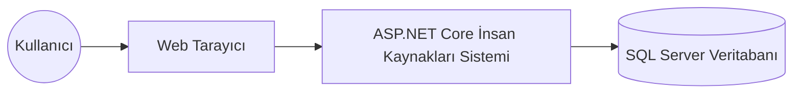
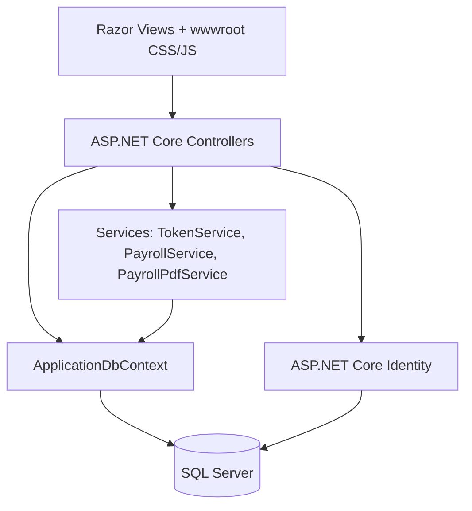
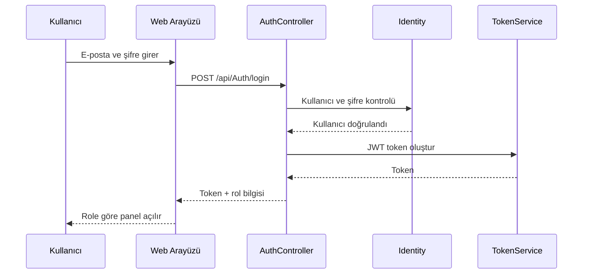
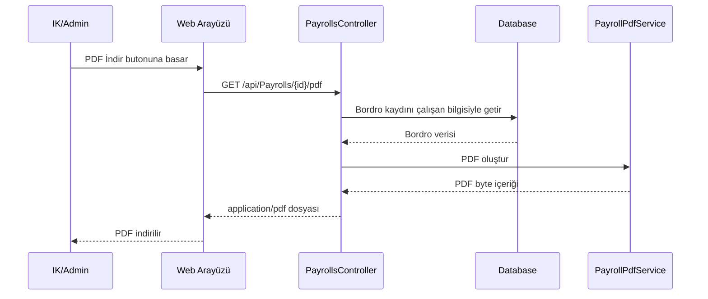
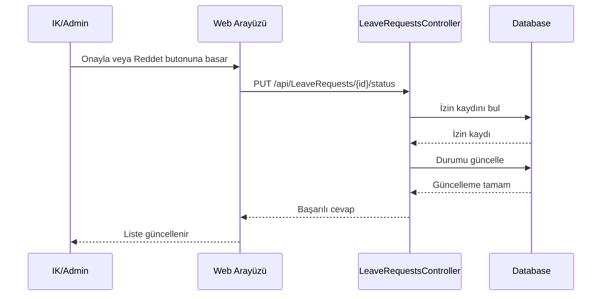
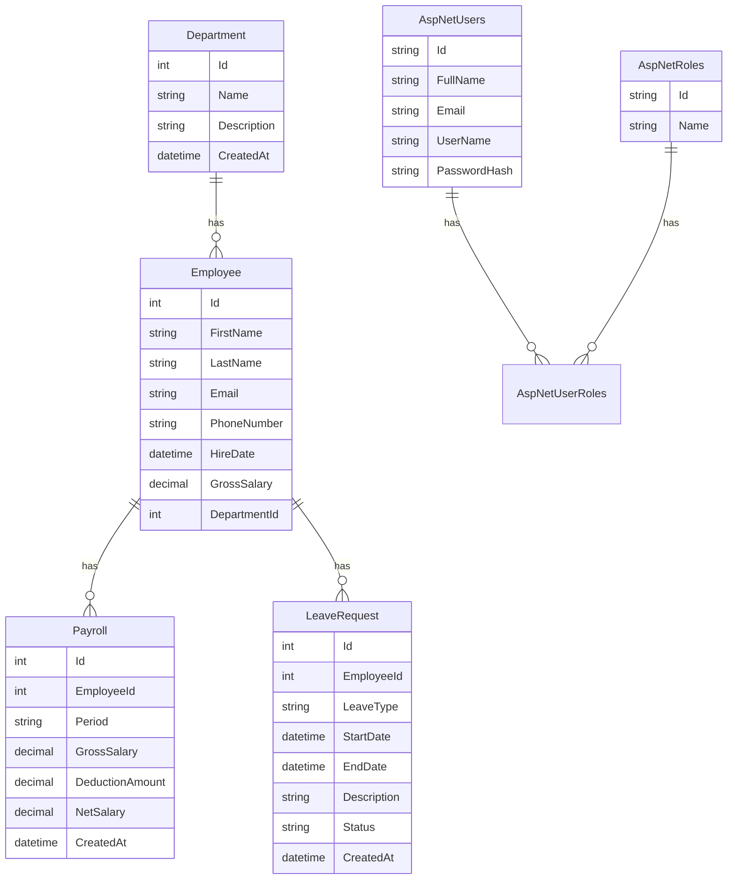
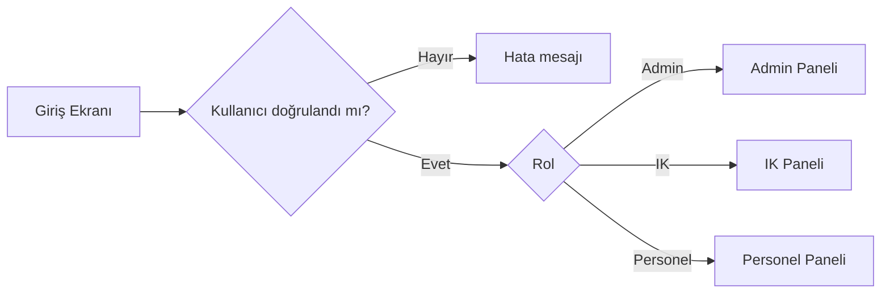
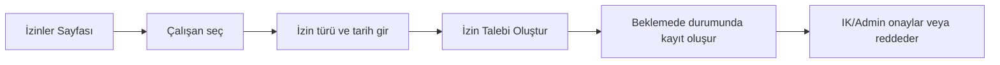
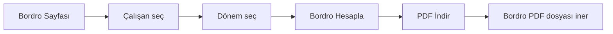

# C# .NET Core İnsan Kaynakları Yönetim Sistemi API

> **Proje Kodu:** P30 · **Zorluk:** Zor · **Puan:** 55 · **Hafta:** 3

**Öğrenci:** SEMANUR YILDIRIM  
**Öğrenci No:** 23080410007  
**E-posta:** semanuryildirim.03@gmail.com  
**Ders:** BMU1208 Web Tabanlı Programlama — *Dr. Öğr. Üyesi Davut ARI*  
**Kurum:** Bitlis Eren Üniversitesi — Mühendislik-Mimarlık Fakültesi — Bilgisayar Mühendisliği  
**Dönem:** 2025-2026 Bahar  
**Son Güncelleme:** 17.05.2026

---

## İçindekiler

1. [Proje Künyesi](#1-proje-künyesi)
2. [Executive Summary](#2-executive-summary)
3. [Problem ve Motivasyon](#3-problem-ve-motivasyon)
4. [Hedef Kitle ve Persona](#4-hedef-kitle-ve-persona)
5. [Ürün Gereksinimleri PRD](#5-ürün-gereksinimleri-prd)
6. [Piyasa ve Rekabet Analizi](#6-piyasa-ve-rekabet-analizi)
7. [Teknoloji Yığını Tech Stack](#7-teknoloji-yığını-tech-stack)
8. [Sistem Mimarisi](#8-sistem-mimarisi)
9. [Veri Modeli ve API Tasarımı](#9-veri-modeli-ve-api-tasarımı)
10. [UI/UX Tasarımı](#10-uiux-tasarımı)
11. [Güvenlik, Performans, Test](#11-güvenlik-performans-test)
12. [Maliyet, Gelir Modeli, GTM](#12-maliyet-gelir-modeli-gtm)
13. [Ek: Post-Launch Review](#13-ek-post-launch-review)

---

## 1. Proje Künyesi

| Alan | Değer |
|------|-------|
| Proje Adı | .NET Core İnsan Kaynakları Yönetim Sistemi API |
| Proje Kodu | P30 |
| Slogan | İnsan kaynakları süreçlerini tek panelde yöneten modern web tabanlı sistem |
| Kategori | İnsan Kaynakları / Kurumsal Yönetim / Web Tabanlı Programlama |
| Hedef Platform | Web, responsive masaüstü ve mobil tarayıcı |
| GitHub | https://github.com/semanuryldrm/HumanResourcesApi |
| Canlı Demo | Yerel geliştirme ortamında çalıştırılmaktadır |
| Demo Kullanıcı | Admin: `admin@example.com` / `123456` |
| Demo Kullanıcı | IK: `ik@example.com` / `123456` |
| Demo Kullanıcı | Personel: `personel@example.com` / `123456` |
| Lisans | MIT |
| Başlangıç | 2026-04-15 |
| Hedef Bitiş | 2026-06-15 |
| Durum | Geliştirme tamamlandı, final teslimine hazır |

### Varsayılan Tech Stack Özeti

| Katman | Teknolojiler |
|--------|--------------|
| Backend | ASP.NET Core 8, C# |
| Web Arayüzü | ASP.NET Core MVC, Razor View, HTML, CSS, JavaScript |
| API | ASP.NET Core Web API |
| Database | SQL Server / SQL Server Express |
| ORM | Entity Framework Core |
| Auth | ASP.NET Core Identity + JWT |
| Rol Yönetimi | Admin, IK, Personel |
| PDF | QuestPDF |
| API Dokümantasyonu | Swagger / OpenAPI |
| Versiyon Kontrol | Git ve GitHub |

---

## 2. Executive Summary

### 2.1 Ne Yapıyoruz?

Bu projede ASP.NET Core kullanılarak web tabanlı bir insan kaynakları yönetim sistemi geliştirilmiştir. Sistem; kullanıcı girişi, rol bazlı yetkilendirme, departman yönetimi, çalışan yönetimi, izin yönetimi, bordro hesaplama, bordro PDF raporu alma ve dashboard istatistikleri gibi temel insan kaynakları işlemlerini tek bir arayüz üzerinden sunmaktadır.

Proje hem MVC hem de Web API yapısını birlikte kullanmaktadır. Kullanıcı arayüzü Razor View, HTML, CSS ve JavaScript ile hazırlanmıştır. Veri işlemleri API endpointleri üzerinden gerçekleştirilmekte, veriler SQL Server veritabanında Entity Framework Core aracılığıyla tutulmaktadır.

### 2.2 Neden Şimdi?

Kurumlarda insan kaynakları süreçleri çoğu zaman farklı dosyalarda, manuel listelerde veya birbirinden kopuk sistemlerde takip edilmektedir. Bu durum departman, çalışan, izin ve bordro bilgilerinin düzenli şekilde izlenmesini zorlaştırmaktadır. Web tabanlı bir sistem ile bu işlemler merkezi hale getirilerek hem veri takibi kolaylaştırılmış hem de yönetim süreçleri daha düzenli bir yapıya alınmıştır.

Bu proje, Web Tabanlı Programlama dersi kapsamında modern backend geliştirme, API tasarımı, MVC mimarisi, veritabanı yönetimi, kimlik doğrulama, rol bazlı yetkilendirme ve kullanıcı arayüzü geliştirme konularını bütünleşik şekilde uygulamak amacıyla hazırlanmıştır.

### 2.3 Başarı Nasıl Görünüyor?

Proje başarı kriteri, sistemin yerel ortamda sorunsuz çalışması ve temel insan kaynakları işlemlerini uçtan uca gerçekleştirebilmesidir. Kullanıcı giriş yapabilmeli, rolüne göre uygun ekranları görebilmeli, departman ve çalışan kayıtları yönetilebilmeli, izin talepleri oluşturulup durumları takip edilebilmeli, bordro hesaplanabilmeli ve bordro raporu PDF olarak indirilebilmelidir.

Final sürümünde proje; demo kullanıcıları otomatik oluşturabilen, modern responsive arayüze sahip, GitHub teslim klasör yapısına uygun ve SQL Server üzerinde çalışan bir insan kaynakları yönetim sistemi haline getirilmiştir.

---

## 3. Problem ve Motivasyon

### 3.1 Hangi Probleme Çözüm Getiriyoruz?

İnsan kaynakları süreçlerinde çalışan bilgilerinin, departmanların, izin taleplerinin ve bordro kayıtlarının düzenli tutulması önemlidir. Küçük ve orta ölçekli kurumlarda bu bilgiler çoğu zaman Excel dosyalarında veya manuel belgelerde tutulmaktadır. Bu yöntemler başlangıçta yeterli görünse de veri sayısı arttıkça takip zorlaşır, güncelleme hataları oluşur ve kullanıcıların hangi işlemleri yapabileceği net olarak kontrol edilemez.

Bu proje, bu problemi temel seviyede çözmek için geliştirilmiştir. Sistem, insan kaynakları süreçlerini tek bir web paneli üzerinden yönetmeyi sağlar. Departman, çalışan, izin ve bordro kayıtları veritabanında tutulur. Kullanıcıların yetkileri role göre ayrılır. Böylece Admin, IK ve Personel kullanıcıları sistemde farklı yetkilere sahip olur.

### 3.2 Kanıt: Problem Gerçekten Var Mı?

Bu problem eğitim projesi kapsamında gerçek hayattaki insan kaynakları iş akışlarından hareketle ele alınmıştır. Bir kurumda çalışan bilgileri, departman ilişkileri, izin talepleri ve maaş bordrosu gibi veriler birbirine bağlıdır. Bu verilerin merkezi bir sistemde tutulmaması durumunda aşağıdaki sorunlar ortaya çıkar:

- Aynı çalışan bilgisinin farklı yerlerde farklı şekilde tutulması
- Departman ve çalışan ilişkisinin net izlenememesi
- İzin taleplerinin kimin tarafından onaylandığının takip edilememesi
- Bordro hesaplarının manuel yapılması nedeniyle hata riskinin artması
- Her kullanıcının her işlemi görebilmesi nedeniyle yetki karmaşası oluşması

Projede bu sorunlara karşı merkezi veritabanı, rol bazlı yetkilendirme ve web tabanlı yönetim paneli kullanılmıştır.

### 3.3 Mevcut Çözümler ve Eksikleri

| Mevcut çözüm | Kullanıcıya ne vadeder? | Neden yetersiz? |
|--------------|------------------------|-----------------|
| Excel / manuel dosyalar | Hızlı kayıt tutma | Yetkilendirme, otomatik hesaplama ve merkezi erişim zayıftır |
| Basit personel listeleri | Çalışan bilgisini saklama | İzin, bordro ve rol yönetimi gibi süreçleri kapsamaz |
| Büyük kurumsal İK yazılımları | Kapsamlı insan kaynakları yönetimi | Küçük ölçekli eğitim projeleri için fazla karmaşık ve maliyetlidir |
| Sadece API tabanlı sistemler | Veri işlemlerini servis olarak sunma | Son kullanıcı için görsel arayüz eksik kalır |
| Sadece statik web arayüzleri | Görsel kullanım kolaylığı | Veritabanı, kimlik doğrulama ve iş mantığı eksik kalabilir |

### 3.4 Bizim Diferansiyasyonumuz

1. Proje hem MVC web arayüzü hem de Web API yapısını birlikte kullanmaktadır.
2. Kullanıcılar Admin, IK ve Personel rollerine göre farklı ekranlar görmektedir.
3. Bordro kayıtları yalnızca hesaplanmakla kalmayıp PDF olarak indirilebilmektedir.
4. İzin yönetimi ayrı bir modül olarak eklenmiştir.
5. Demo kullanıcılar otomatik oluşturulduğu için proje ilk çalıştırmada test edilebilir durumdadır.
6. Modern responsive arayüz ile sistem daha profesyonel görünmektedir.
7. Teslim yapısı hocanın verdiği `repo/` klasör düzenine uygun tutulmuştur.

### 3.5 Kapsam Dışı Bıraktığımız Problemler

V1 sürümünde aşağıdaki konular kapsam dışında bırakılmıştır:

- Gerçek SGK, gelir vergisi ve işsizlik sigortası hesapları
- Gerçek e-posta doğrulama ve şifre sıfırlama sistemi
- Bulut ortamında canlı yayınlama
- Mobil uygulama
- Gelişmiş raporlama ve grafik paneli
- Gerçek kurum hiyerarşisi ve organizasyon şeması
- Çoklu şirket / çoklu şube desteği

Bu özellikler ileride geliştirilebilecek V2 özellikleri olarak değerlendirilebilir.

---

## 4. Hedef Kitle ve Persona

### 4.1 Birincil Segment

Birincil hedef kitle; küçük ve orta ölçekli kurumlarda çalışan insan kaynakları görevlileri, departman yöneticileri ve personel kayıtlarını düzenli şekilde takip etmek isteyen idari kullanıcılardır.

### 4.2 İkincil Segment

İkincil hedef kitle; ASP.NET Core, MVC, Web API, Entity Framework Core, Identity, JWT ve SQL Server teknolojilerini öğrenmek isteyen bilgisayar mühendisliği öğrencileri ve yazılım geliştirici adaylarıdır.

### 4.3 Persona Kartları

#### 👩‍💼 Persona 1 — Ayşe Demir

| Alan | Değer |
|------|-------|
| Yaş / Şehir | 32 / Bitlis |
| Rol / Meslek | İnsan Kaynakları Uzmanı |
| Teknoloji kullanımı | Web tabanlı yönetim panellerini kullanabiliyor |
| Günlük rutini | Çalışan kayıtlarını kontrol eder, izin taleplerini takip eder, departman bilgilerini günceller |
| Ana hedefi | Personel süreçlerini tek panelden yönetmek |
| Pain points | Dağınık kayıtlar, manuel izin takibi, bordro hesaplama hataları |
| Ürünümüzü ne zaman açar? | Yeni çalışan eklemek, izin talebini kontrol etmek veya bordro oluşturmak istediğinde |
| Motto | "Tüm personel bilgilerini tek ekranda görmek istiyorum." |

#### 👨‍🎓 Persona 2 — Mehmet Kaya

| Alan | Değer |
|------|-------|
| Yaş / Şehir | 24 / Bitlis |
| Rol / Meslek | Personel |
| Teknoloji kullanımı | Temel web uygulamalarını kullanabiliyor |
| Günlük rutini | Kendi izin talebini oluşturmak ve durumunu takip etmek ister |
| Ana hedefi | İnsan kaynaklarına gitmeden izin durumunu görebilmek |
| Pain points | İzin talebinin durumunu öğrenememe, yetkisi olmayan karmaşık ekranlarla karşılaşma |
| Ürünümüzü ne zaman açar? | İzin talebi oluşturmak veya mevcut izin durumunu kontrol etmek istediğinde |
| Motto | "Sadece bana gerekli olan ekranları görmek istiyorum." |

### 4.4 Jobs To Be Done

1. When I'm an **IK user**, I want to **add and manage employees**, so I can **keep personnel records organized**.
2. When I'm an **Admin user**, I want to **manage all departments, employees, payrolls and leave requests**, so I can **control the whole HR workflow**.
3. When I'm a **Personel user**, I want to **create a leave request**, so I can **send my request without using a manual process**.
4. When I'm an **IK user**, I want to **download payroll reports as PDF**, so I can **archive salary calculations easily**.
5. When I'm a **system user**, I want to **see dashboard statistics**, so I can **understand the current HR status quickly**.

### 4.5 Persona'lar Hangi Feature'ları Öncelikli Kullanır?

| Özellik | Ayşe Demir / IK | Mehmet Kaya / Personel |
|---------|------------------|-------------------------|
| Departman yönetimi | Çok | Yok |
| Çalışan yönetimi | Çok | Yok |
| İzin talebi oluşturma | Orta | Çok |
| İzin onaylama / reddetme | Çok | Yok |
| Bordro hesaplama | Çok | Yok |
| Bordro PDF indirme | Çok | Az |
| Dashboard istatistikleri | Çok | Orta |
| Role göre sade arayüz | Orta | Çok |

---

## 5. Ürün Gereksinimleri PRD

### 5.1 Ana Hedef ve North Star Metric

- **Ana hedef:** İnsan kaynakları süreçlerini web tabanlı, rol kontrollü ve merkezi bir sistem üzerinden yönetmek.
- **North Star Metric:** Başarıyla tamamlanan insan kaynakları işlemi sayısı.
- **Destekleyici metrikler:**
  - Oluşturulan çalışan kaydı sayısı
  - Oluşturulan izin talebi sayısı
  - Hesaplanan bordro sayısı
  - PDF olarak indirilen bordro raporu sayısı
  - Rol bazlı yetkilendirme ile engellenen yetkisiz işlem sayısı

### 5.2 Kapsam

#### In-Scope V1

1. Kullanıcı kayıt ve giriş işlemleri
2. JWT tabanlı kimlik doğrulama
3. Admin / IK / Personel rolleri
4. Role göre frontend görünümü
5. Departman CRUD işlemleri
6. Çalışan CRUD işlemleri
7. İzin talebi oluşturma ve izin durumu yönetimi
8. Bordro hesaplama
9. Bordro PDF raporu indirme
10. Dashboard istatistikleri
11. SQL Server veritabanı
12. Swagger API test arayüzü
13. Modern responsive arayüz

#### Out-of-Scope V1

- Gerçek bordro mevzuatı hesapları
- E-posta doğrulama sistemi
- Şifre sıfırlama
- Bulut deployment
- Mobil uygulama
- Çoklu şirket desteği
- Gelişmiş grafik raporlama
- Gerçek ödeme veya muhasebe entegrasyonu

### 5.3 Fonksiyonel Gereksinimler User Stories

#### FR-01 — Kullanıcı Kayıt

> As a **new user**, I want to **register with my full name, email and password**, so that **I can access the system**.

**Acceptance Criteria:**
- Given kullanıcı kayıt formunu doldurur, When kayıt butonuna basar, Then sistem kullanıcıyı oluşturur.
- Given e-posta daha önce kayıtlıysa, When kullanıcı kayıt olmaya çalışır, Then sistem hata mesajı gösterir.

**Öncelik:** Must  
**Tahmini efor:** M

#### FR-02 — Kullanıcı Girişi

> As a **registered user**, I want to **login with email and password**, so that **I can use the HR system**.

**Acceptance Criteria:**
- Given doğru e-posta ve şifre girilir, When giriş yapılır, Then JWT token oluşturulur.
- Given şifre hatalıysa, When giriş yapılır, Then sistem hata mesajı döndürür.

**Öncelik:** Must  
**Tahmini efor:** M

#### FR-03 — Rol Bazlı Yetkilendirme

> As an **Admin**, I want to **control user permissions by role**, so that **users only access allowed operations**.

**Acceptance Criteria:**
- Given kullanıcı Personel rolündeyse, When sisteme girerse, Then yönetim menülerini görmez.
- Given kullanıcı Admin veya IK rolündeyse, When sisteme girerse, Then yönetim ekranlarını görebilir.

**Öncelik:** Must  
**Tahmini efor:** L

#### FR-04 — Departman Yönetimi

> As an **IK user**, I want to **create and manage departments**, so that **employees can be grouped by department**.

**Acceptance Criteria:**
- Given departman adı girilir, When kaydet butonuna basılır, Then departman veritabanına eklenir.
- Given departmana bağlı çalışan varsa, When departman silinmek istenir, Then sistem silme işlemine izin vermez.

**Öncelik:** Must  
**Tahmini efor:** M

#### FR-05 — Çalışan Yönetimi

> As an **IK user**, I want to **create and update employee records**, so that **employee data stays organized**.

**Acceptance Criteria:**
- Given çalışan bilgileri eksiksiz girilir, When kaydet butonuna basılır, Then çalışan kaydı oluşturulur.
- Given aynı e-posta ile çalışan varsa, When yeni kayıt girilir, Then sistem uyarı verir.

**Öncelik:** Must  
**Tahmini efor:** M

#### FR-06 — Bordro Hesaplama

> As an **IK user**, I want to **calculate payroll from gross salary**, so that **net salary can be seen quickly**.

**Acceptance Criteria:**
- Given çalışan seçilir ve dönem girilir, When hesapla butonuna basılır, Then brüt maaş, kesinti ve net maaş hesaplanır.
- Given aynı dönem için bordro varsa, When tekrar hesaplama yapılır, Then sistem tekrar kayıt oluşturmaz.

**Öncelik:** Must  
**Tahmini efor:** M

#### FR-07 — Bordro PDF İndirme

> As an **IK user**, I want to **download payroll as PDF**, so that **I can archive payroll records**.

**Acceptance Criteria:**
- Given bordro kaydı vardır, When PDF indir butonuna basılır, Then PDF dosyası indirilir.
- Given bordro bulunamazsa, When PDF endpoint çağrılır, Then sistem hata döndürür.

**Öncelik:** Should  
**Tahmini efor:** M

#### FR-08 — İzin Talebi Oluşturma

> As a **Personel**, I want to **create a leave request**, so that **IK can review my request**.

**Acceptance Criteria:**
- Given çalışan, izin türü ve tarih aralığı seçilir, When izin talebi oluşturulur, Then durum Beklemede olur.
- Given bitiş tarihi başlangıçtan önceyse, When kayıt yapılır, Then sistem hata mesajı verir.

**Öncelik:** Must  
**Tahmini efor:** M

#### FR-09 — İzin Durumu Yönetimi

> As an **IK user**, I want to **approve or reject leave requests**, so that **leave processes can be controlled**.

**Acceptance Criteria:**
- Given izin talebi Beklemede durumundadır, When IK onaylar, Then durum Onaylandı olur.
- Given izin talebi Beklemede durumundadır, When IK reddeder, Then durum Reddedildi olur.

**Öncelik:** Should  
**Tahmini efor:** M

#### FR-10 — Dashboard İstatistikleri

> As an **Admin or IK user**, I want to **see summary cards**, so that **I can understand system status quickly**.

**Acceptance Criteria:**
- Given sistemde kayıtlar vardır, When ana sayfa açılır, Then departman, çalışan, bordro ve izin sayıları görünür.
- Given izin talepleri farklı durumlardadır, When dashboard açılır, Then bekleyen, onaylanan ve reddedilen izin sayıları ayrı gösterilir.

**Öncelik:** Should  
**Tahmini efor:** S

#### FR-11 — Demo Kullanıcıların Oluşturulması

> As a **teacher or evaluator**, I want to **login with ready demo accounts**, so that **I can test the system quickly**.

**Acceptance Criteria:**
- Given uygulama çalışır, When SeedData devreye girer, Then Admin, IK ve Personel hesapları oluşturulur.
- Given hesaplar zaten varsa, When uygulama tekrar çalışır, Then aynı hesaplar yeniden oluşturulmaz.

**Öncelik:** Should  
**Tahmini efor:** S

#### FR-12 — Modern Responsive Arayüz

> As a **user**, I want to **use a clean and modern interface**, so that **the system feels understandable and professional**.

**Acceptance Criteria:**
- Given kullanıcı masaüstünden girer, When panel açılır, Then sidebar ve kartlar düzgün görünür.
- Given kullanıcı daha küçük ekrandan girer, When sayfa açılır, Then ekran tek kolona uyum sağlar.

**Öncelik:** Could  
**Tahmini efor:** M

### 5.4 Non-Functional Requirements

| Kategori | Gereksinim | Nasıl ölçülecek? |
|----------|------------|------------------|
| Performans | Temel API istekleri yerel ortamda hızlı dönmelidir | Manuel test ve tarayıcı network sekmesi |
| Güvenlik | Korumalı endpointler JWT istemelidir | Swagger ve frontend testleri |
| Yetkilendirme | Yönetim işlemleri Admin / IK rolleriyle sınırlı olmalıdır | Personel hesabı ile işlem denemesi |
| Kullanılabilirlik | Arayüz anlaşılır ve sade olmalıdır | Manuel UI testi |
| Uyumluluk | Modern tarayıcılarda çalışmalıdır | Chrome testi |
| Veri bütünlüğü | Çalışan departmana bağlı tutulmalıdır | SQL Server kayıt kontrolü |
| Raporlama | Bordro PDF indirilebilir olmalıdır | PDF indirme testi |

### 5.5 Bağımlılıklar ve Riskler

| Bağımlılık | Risk | Azaltma |
|------------|------|---------|
| SQL Server | Farklı bilgisayarda server adı değişebilir | README içinde bağlantı açıklaması verildi |
| EF Core Migration | Migration uygulanmazsa tablolar oluşmaz | Kurulum adımlarında `dotnet ef database update` belirtildi |
| JWT Token | Eski token rol bilgisini taşımayabilir | Çıkış yapıp tekrar giriş yapılması önerildi |
| QuestPDF | Lisans ayarı yapılmazsa hata verebilir | Program.cs içinde Community lisans ayarı eklendi |
| Rol tabloları | Roller yoksa yetkilendirme çalışmaz | SeedData ve AuthController rol oluşturma desteği eklendi |

### 5.6 Açık Sorular

1. Sistem ileride gerçek bordro mevzuatına göre geliştirilecek mi?
2. Personel sadece kendi bordrosunu ve kendi izinlerini mi görmeli?
3. Proje ileride canlı ortama alınacak mı?
4. E-posta doğrulama ve şifre sıfırlama eklenecek mi?
5. Dashboard grafiklerle daha gelişmiş hale getirilecek mi?

---

## 6. Piyasa ve Rekabet Analizi

### 6.1 Pazar Büyüklüğü TAM / SAM / SOM

Bu proje ticari bir ürün olarak değil, Web Tabanlı Programlama dersi final projesi olarak geliştirilmiştir. Bu nedenle pazar büyüklüğü doğrudan gelir hedefi üzerinden değil, kullanılabilecek kurum tipi üzerinden yorumlanmıştır.

- **TAM:** İnsan kaynakları süreçlerini dijital ortamda yürütmek isteyen tüm kurumlar.
- **SAM:** Küçük ve orta ölçekli kurumlarda temel çalışan, departman, izin ve bordro takibi yapmak isteyen işletmeler.
- **SOM:** Eğitim projesi kapsamında yerel ortamda test edilebilen ve küçük ölçekli kurum süreçlerini temsil eden MVP kapsamı.

### 6.2 Rakip Analizi Feature Matrix

| Özellik | Bizim Proje | Excel | Basit Personel Listesi | Kurumsal İK Yazılımı | Sadece API Projesi | Manuel Süreç |
|---------|-------------|-------|------------------------|----------------------|--------------------|--------------|
| Web arayüzü | ✅ | ❌ | Kısmen | ✅ | ❌ | ❌ |
| Veritabanı | ✅ | ❌ | Kısmen | ✅ | ✅ | ❌ |
| Rol bazlı yetki | ✅ | ❌ | ❌ | ✅ | Kısmen | ❌ |
| Departman yönetimi | ✅ | Kısmen | Kısmen | ✅ | Kısmen | ❌ |
| Çalışan yönetimi | ✅ | ✅ | ✅ | ✅ | ✅ | Kısmen |
| İzin yönetimi | ✅ | Kısmen | ❌ | ✅ | Kısmen | Kısmen |
| Bordro hesaplama | ✅ | Kısmen | ❌ | ✅ | Kısmen | ❌ |
| PDF rapor | ✅ | ❌ | ❌ | ✅ | Kısmen | ❌ |
| Dashboard | ✅ | ❌ | ❌ | ✅ | ❌ | ❌ |
| Eğitim projesine uygun sade yapı | ✅ | ✅ | ✅ | ❌ | ✅ | ✅ |

### 6.3 Detaylı Rakip Profilleri

#### Rakip 1: Excel / Manuel Tablo

- **Güçlü yönler:**
  1. Kurulumu kolaydır.
  2. Her bilgisayarda kullanılabilir.
  3. Küçük listeler için hızlıdır.
- **Zayıf yönler:**
  1. Rol bazlı yetkilendirme yoktur.
  2. Veri bütünlüğü zayıftır.
  3. PDF bordro, izin yönetimi ve dashboard gibi modüller bütünleşik değildir.

#### Rakip 2: Kurumsal İK Yazılımları

- **Güçlü yönler:**
  1. Kapsamlı özelliklere sahiptir.
  2. Gerçek bordro ve raporlama destekleri bulunabilir.
  3. Büyük kurumlar için uygundur.
- **Zayıf yönler:**
  1. Eğitim projesi için fazla karmaşıktır.
  2. Kurulum ve maliyet daha yüksektir.
  3. Kod seviyesi öğrenim amacıyla incelenemez.

#### Rakip 3: Sadece API Tabanlı Projeler

- **Güçlü yönler:**
  1. Backend mimarisini göstermek için uygundur.
  2. Swagger ile test edilebilir.
  3. Servis tabanlı yapı sağlar.
- **Zayıf yönler:**
  1. Son kullanıcı için web arayüzü yoktur.
  2. Kullanım deneyimi eksik kalır.
  3. MVC yapısı gösterilemez.

### 6.4 SWOT Analizi

```
┌────────────────────────────────────┬────────────────────────────────────┐
│ GÜÇLÜ YÖNLER                       │ ZAYIF YÖNLER                       │
│ - MVC + Web API birlikte kullanıldı │ - Gerçek bordro mevzuatı yok       │
│ - Rol bazlı yetkilendirme var       │ - Canlı deployment yapılmadı       │
│ - PDF bordro raporu var             │ - Grafiksel raporlama sınırlı      │
│ - Modern responsive arayüz var      │ - Personel kendi verisiyle sınırlı │
├────────────────────────────────────┼────────────────────────────────────┤
│ FIRSATLAR                          │ TEHDİTLER                          │
│ - Gerçek İK sistemine dönüşebilir   │ - Mevzuat hesapları karmaşık       │
│ - Mobil uygulama eklenebilir        │ - Yetki kapsamı genişletilmeli     │
│ - Dashboard grafikle gelişebilir    │ - Canlı ortamda güvenlik artmalı   │
└────────────────────────────────────┴────────────────────────────────────┘
```

### 6.5 Positioning Statement

> **FOR** küçük ve orta ölçekli insan kaynakları süreçlerini yönetmek isteyen kullanıcılar  
> **WHO** çalışan, departman, izin ve bordro kayıtlarını düzenli takip etmek ister  
> **OUR PRODUCT IS A** web tabanlı insan kaynakları yönetim sistemi  
> **THAT** temel İK işlemlerini tek panelde ve rol bazlı şekilde sunar  
> **UNLIKE** manuel Excel listeleri veya sadece API örnekleri  
> **OUR PRODUCT** MVC arayüzü, Web API yapısı, SQL Server veritabanı, rol bazlı yetkilendirme ve PDF raporlama özelliklerini birlikte içerir.

---

## 7. Teknoloji Yığını Tech Stack

### 7.1 Özet Tablo

| Katman | Teknoloji | Versiyon | Rol |
|--------|-----------|----------|-----|
| Backend | ASP.NET Core | 8 | API ve MVC altyapısı |
| Programlama dili | C# | 12 / .NET 8 uyumlu | Uygulama geliştirme |
| Frontend | Razor View, HTML, CSS, JavaScript | Standart web teknolojileri | Kullanıcı arayüzü |
| Styling | CSS | Custom | Modern responsive tasarım |
| Database | SQL Server / SQL Server Express | LocalDB / SQLEXPRESS | Kalıcı veri depolama |
| ORM | Entity Framework Core | 8 | Veritabanı işlemleri |
| Auth | ASP.NET Core Identity | 8 | Kullanıcı ve rol yönetimi |
| Token | JWT | Bearer Token | Kimlik doğrulama |
| PDF | QuestPDF | NuGet paketi | Bordro PDF raporu |
| API Docs | Swagger / OpenAPI | ASP.NET Core Swagger | API test |
| Version Control | Git & GitHub | Git | Teslim ve sürüm kontrolü |

### 7.2 Her Teknoloji İçin Detay

#### 7.2.1 ASP.NET Core 8

- **Ne?** Microsoft tarafından geliştirilen modern, açık kaynaklı web uygulama geliştirme framework'üdür.
- **Kategori:** Backend framework
- **Neden seçildi:**
  1. Web API ve MVC yapısını aynı projede kullanmayı sağlar.
  2. Identity, JWT, middleware ve dependency injection desteği güçlüdür.
  3. C# ve .NET ekosistemiyle kurumsal projeler için uygundur.
- **Temel özellikler:**
  - Controller tabanlı API
  - MVC ve Razor View desteği
  - Dependency Injection
  - Middleware pipeline
  - Swagger entegrasyonu
  - Authentication / Authorization desteği
- **Projedeki rolü:** Projenin ana backend ve web arayüz altyapısıdır.
- **Alternatifler:** Node.js Express, Django, Spring Boot.
- **Trade-off:** ASP.NET Core proje yapısı başlangıçta daha fazla dosya ve kavram içerir.

#### 7.2.2 SQL Server + Entity Framework Core

- **Ne?** SQL Server ilişkisel veritabanı, Entity Framework Core ise .NET için ORM aracıdır.
- **Kategori:** Database + ORM
- **Neden seçildi:**
  1. ASP.NET Core ile uyumludur.
  2. Migration desteğiyle veritabanı sürüm kontrolü sağlar.
  3. LINQ ile sorgu yazmayı kolaylaştırır.
- **Temel özellikler:**
  - DbContext yapısı
  - Migration desteği
  - LINQ sorguları
  - Entity ilişkileri
  - SQL Server bağlantısı
- **Projedeki rolü:** Departman, çalışan, bordro ve izin kayıtlarının saklanmasını sağlar.
- **Alternatifler:** PostgreSQL, MySQL, SQLite.
- **Trade-off:** Farklı bilgisayarda SQL Server bağlantı adı güncellenmelidir.

#### 7.2.3 ASP.NET Core Identity + JWT

- **Ne?** Identity kullanıcı ve rol yönetimi sağlar; JWT ise token tabanlı kimlik doğrulama yapar.
- **Kategori:** Authentication / Authorization
- **Neden seçildi:**
  1. Kullanıcı kayıt ve giriş işlemlerini güvenli hale getirir.
  2. Role göre yetkilendirme sağlar.
  3. API endpointlerinin korunmasını kolaylaştırır.
- **Temel özellikler:**
  - Kullanıcı oluşturma
  - Şifre hashleme
  - Rol yönetimi
  - JWT token üretimi
  - Endpoint koruma
- **Projedeki rolü:** Admin, IK ve Personel kullanıcılarının yetkilerini belirlemek için kullanılmıştır.
- **Alternatifler:** Manuel auth sistemi, OAuth sağlayıcıları.
- **Trade-off:** Identity tabloları ve rol yapısı doğru yapılandırılmalıdır.

#### 7.2.4 QuestPDF

- **Ne?** .NET ortamında PDF dokümanı üretmek için kullanılan bir kütüphanedir.
- **Kategori:** PDF oluşturma
- **Neden seçildi:**
  1. C# ile doğrudan PDF oluşturmayı sağlar.
  2. Bordro raporu gibi tablo tabanlı çıktılar için uygundur.
  3. Kod içinde düzenlenebilir rapor şablonu sunar.
- **Temel özellikler:**
  - PDF sayfa yapısı oluşturma
  - Başlık, tablo ve metin ekleme
  - A4 format desteği
  - Byte array olarak PDF üretme
- **Projedeki rolü:** Bordro kayıtlarının PDF olarak indirilmesini sağlamaktadır.
- **Alternatifler:** iTextSharp, Rotativa, PDFSharp.
- **Trade-off:** Lisans ayarı uygulama başlangıcında yapılmalıdır.

#### 7.2.5 HTML, CSS ve JavaScript

- **Ne?** Web arayüzünün temel teknolojileridir.
- **Kategori:** Frontend
- **Neden seçildi:**
  1. Razor View ile kolay entegre olur.
  2. Ek frontend framework kurmadan hızlı geliştirme sağlar.
  3. Eğitim projesi için sade ve anlaşılırdır.
- **Temel özellikler:**
  - Formlar
  - Dinamik listeleme
  - Fetch API ile backend bağlantısı
  - Responsive tasarım
  - Role göre görünüm yönetimi
- **Projedeki rolü:** Kullanıcı panelinin görsel ve etkileşimli tarafını oluşturur.
- **Alternatifler:** React, Angular, Vue.
- **Trade-off:** Büyük projelerde manuel JavaScript yönetimi zorlaşabilir.

### 7.3 Reddedilen Teknoloji Kararları

| Aday | Kategori | Neden seçmedik |
|------|----------|----------------|
| React | Frontend framework | Projenin MVC yapısı göstermesi gerektiği için Razor View tercih edildi |
| PostgreSQL | Database | Yerel SQL Server / SQL Express kullanımı proje için daha uygundu |
| Docker | Deployment | Yerel final teslimi için gerekli görülmedi |
| Redis | Cache | Proje veri hacmi küçük olduğu için ihtiyaç olmadı |
| Gerçek e-posta servisi | Mail | Kayıt/giriş için şimdilik zorunlu değildi |

### 7.4 Tech Stack Mimari Kararı ADR Özeti

- **ADR-001:** MVC + Web API birlikte kullanılacak. Böylece hem görsel arayüz hem de API endpointleri gösterilecektir.
- **ADR-002:** SQL Server ve EF Core kullanılacak. Çünkü proje .NET ekosisteminde ilişkisel veri yönetimi gerektirmektedir.
- **ADR-003:** Identity + JWT kullanılacak. Çünkü kullanıcı girişi ve rol bazlı yetkilendirme gereklidir.
- **ADR-004:** Bordro raporları için QuestPDF kullanılacak. Çünkü bordro çıktısı PDF olarak indirilebilir olmalıdır.

---

## 8. Sistem Mimarisi

### 8.1 Yüksek Seviye Mimari C4 Level 1



### 8.2 Container Seviyesi C4 Level 2



### 8.3 Önemli Akışlar Sequence Diagrams

#### 8.3.1 Kullanıcı Girişi



#### 8.3.2 Bordro PDF İndirme



#### 8.3.3 İzin Talebi Durumu Güncelleme



### 8.4 Deployment Topology

Bu proje final teslimi için yerel geliştirme ortamında çalıştırılacak şekilde hazırlanmıştır.

```
┌──────────────────────────┐
│ Kullanıcı Tarayıcısı     │
└────────────┬─────────────┘
             │ HTTP
             ▼
┌──────────────────────────┐
│ ASP.NET Core Uygulaması  │
│ localhost:5207           │
└────────────┬─────────────┘
             │ EF Core
             ▼
┌──────────────────────────┐
│ SQL Server / SQLEXPRESS  │
│ HumanResourcesDb         │
└──────────────────────────┘
```

### 8.5 Mimari Kararlar ADR'lar

- **ADR-001:** Tek proje içinde MVC ve Web API birlikte kullanılacaktır.
- **ADR-002:** Veritabanı erişiminde Entity Framework Core tercih edilecektir.
- **ADR-003:** Kullanıcı ve rol yönetimi için ASP.NET Core Identity kullanılacaktır.
- **ADR-004:** API güvenliği JWT Bearer Token ile sağlanacaktır.
- **ADR-005:** Bordro PDF çıktısı için QuestPDF servisi kullanılacaktır.

### 8.6 Katlama / Ölçekleme Planı

| Kullanıcı yükü | Aksiyon |
|----------------|---------|
| 0 - 100 kullanıcı | Mevcut monolit yapı yeterlidir |
| 100 - 1K kullanıcı | Veritabanı indexleri ve loglama geliştirilebilir |
| 1K - 10K kullanıcı | API ve frontend ayrıştırılabilir |
| 10K+ kullanıcı | Cache, queue ve yatay ölçekleme değerlendirilebilir |

---

## 9. Veri Modeli ve API Tasarımı

### 9.1 ER Diyagram



### 9.2 Tablolar Ayrıntılı

#### Table: Departments

| Kolon | Tip | Null? | Açıklama |
|-------|-----|-------|----------|
| Id | int | Hayır | Primary key |
| Name | nvarchar(100) | Hayır | Departman adı |
| Description | nvarchar | Evet | Departman açıklaması |
| CreatedAt | datetime2 | Hayır | Oluşturulma tarihi |

#### Table: Employees

| Kolon | Tip | Null? | Açıklama |
|-------|-----|-------|----------|
| Id | int | Hayır | Primary key |
| FirstName | nvarchar(100) | Hayır | Çalışan adı |
| LastName | nvarchar(100) | Hayır | Çalışan soyadı |
| Email | nvarchar(150) | Hayır | Çalışan e-posta adresi |
| PhoneNumber | nvarchar | Evet | Telefon numarası |
| HireDate | datetime2 | Hayır | İşe giriş tarihi |
| GrossSalary | decimal(18,2) | Hayır | Brüt maaş |
| DepartmentId | int | Hayır | Departman foreign key |

#### Table: Payrolls

| Kolon | Tip | Null? | Açıklama |
|-------|-----|-------|----------|
| Id | int | Hayır | Primary key |
| EmployeeId | int | Hayır | Çalışan foreign key |
| Period | nvarchar | Hayır | Bordro dönemi |
| GrossSalary | decimal(18,2) | Hayır | Brüt maaş |
| DeductionAmount | decimal(18,2) | Hayır | Kesinti tutarı |
| NetSalary | decimal(18,2) | Hayır | Net maaş |
| CreatedAt | datetime2 | Hayır | Oluşturulma tarihi |

#### Table: LeaveRequests

| Kolon | Tip | Null? | Açıklama |
|-------|-----|-------|----------|
| Id | int | Hayır | Primary key |
| EmployeeId | int | Hayır | Çalışan foreign key |
| LeaveType | nvarchar(50) | Hayır | İzin türü |
| StartDate | datetime2 | Hayır | Başlangıç tarihi |
| EndDate | datetime2 | Hayır | Bitiş tarihi |
| Description | nvarchar(500) | Evet | Açıklama |
| Status | nvarchar(30) | Hayır | Beklemede / Onaylandı / Reddedildi |
| CreatedAt | datetime2 | Hayır | Oluşturulma tarihi |

#### Table: AspNetUsers

| Kolon | Tip | Null? | Açıklama |
|-------|-----|-------|----------|
| Id | nvarchar | Hayır | Identity kullanıcı id |
| FullName | nvarchar | Hayır | Kullanıcı ad soyad |
| Email | nvarchar | Evet | E-posta |
| UserName | nvarchar | Evet | Kullanıcı adı |
| PasswordHash | nvarchar | Evet | Hashlenmiş şifre |

#### Table: AspNetRoles

| Kolon | Tip | Null? | Açıklama |
|-------|-----|-------|----------|
| Id | nvarchar | Hayır | Rol id |
| Name | nvarchar | Evet | Rol adı |

### 9.3 Index Stratejisi

| Tablo | Index | Amaç |
|-------|-------|------|
| Departments | Id | Departman kayıtlarına hızlı erişim |
| Employees | Id | Çalışan kayıtlarına hızlı erişim |
| Employees | DepartmentId | Departmana göre çalışan listeleme |
| Payrolls | EmployeeId | Çalışana ait bordroları listeleme |
| LeaveRequests | EmployeeId | Çalışana ait izinleri listeleme |
| AspNetUsers | NormalizedEmail | Kullanıcı girişinde e-posta kontrolü |
| AspNetRoles | NormalizedName | Rol kontrolü |

### 9.4 API Tasarımı

#### 9.4.1 Authentication

**POST** `/api/Auth/register`

Request:
```json
{
  "fullName": "Semanur Yıldırım",
  "email": "semanur@example.com",
  "password": "123456"
}
```

Response:
```json
{
  "message": "Kullanıcı kaydı başarılı.",
  "email": "semanur@example.com",
  "role": "Personel",
  "roles": ["Personel"],
  "token": "jwt-token"
}
```

---

**POST** `/api/Auth/login`

Request:
```json
{
  "email": "admin@example.com",
  "password": "123456"
}
```

Response:
```json
{
  "message": "Giriş başarılı.",
  "email": "admin@example.com",
  "role": "Admin",
  "roles": ["Admin"],
  "token": "jwt-token"
}
```

#### 9.4.2 Departments

| Method | Endpoint | Açıklama |
|--------|----------|----------|
| GET | `/api/Departments` | Departmanları listeler |
| GET | `/api/Departments/{id}` | Tek departman getirir |
| POST | `/api/Departments` | Departman oluşturur |
| PUT | `/api/Departments/{id}` | Departman günceller |
| DELETE | `/api/Departments/{id}` | Departman siler |

#### 9.4.3 Employees

| Method | Endpoint | Açıklama |
|--------|----------|----------|
| GET | `/api/Employees` | Çalışanları listeler |
| GET | `/api/Employees/{id}` | Tek çalışan getirir |
| POST | `/api/Employees` | Çalışan oluşturur |
| PUT | `/api/Employees/{id}` | Çalışan günceller |
| DELETE | `/api/Employees/{id}` | Çalışan siler |

#### 9.4.4 Payrolls

| Method | Endpoint | Açıklama |
|--------|----------|----------|
| GET | `/api/Payrolls` | Bordro kayıtlarını listeler |
| GET | `/api/Payrolls/employee/{employeeId}` | Çalışana ait bordroları listeler |
| POST | `/api/Payrolls/calculate/{employeeId}` | Bordro hesaplar |
| GET | `/api/Payrolls/{id}/pdf` | Bordro PDF raporu indirir |
| DELETE | `/api/Payrolls/{id}` | Bordro kaydı siler |

#### 9.4.5 LeaveRequests

| Method | Endpoint | Açıklama |
|--------|----------|----------|
| GET | `/api/LeaveRequests` | İzin taleplerini listeler |
| GET | `/api/LeaveRequests/{id}` | Tek izin talebi getirir |
| POST | `/api/LeaveRequests` | İzin talebi oluşturur |
| PUT | `/api/LeaveRequests/{id}/status` | İzin durumunu günceller |
| DELETE | `/api/LeaveRequests/{id}` | İzin talebini siler |

### 9.5 OpenAPI Spec

Projede Swagger / OpenAPI desteği bulunmaktadır. Uygulama geliştirme ortamında çalıştırıldığında Swagger arayüzüne aşağıdaki adresten erişilebilir:

```text
http://localhost:5207/swagger
```

### 9.6 Rate Limiting Politikası

Bu final projesinde rate limiting uygulanmamıştır. Ancak gerçek ortamda aşağıdaki politika önerilir:

| Endpoint grubu | Önerilen Limit |
|----------------|----------------|
| Auth login/register | 5 istek/dk/IP |
| API okuma | 100 istek/dk/kullanıcı |
| API yazma | 30 istek/dk/kullanıcı |
| PDF oluşturma | 10 istek/dk/kullanıcı |

---

## 10. UI/UX Tasarımı

### 10.1 Bilgi Mimarisi Sitemap

```
/
├── Giriş / Kayıt
├── Dashboard
├── Departmanlar
├── Çalışanlar
├── Bordro
└── İzinler
```

Role göre menü görünümü:

```
Admin / IK
├── Ana Sayfa
├── Departmanlar
├── Çalışanlar
├── Bordro
└── İzinler

Personel
├── Ana Sayfa
└── İzinler
```

### 10.2 User Flow Ana Akışlar

#### Akış 1 — Giriş ve Role Göre Panel



#### Akış 2 — İzin Talebi



#### Akış 3 — Bordro PDF



### 10.3 Design System

#### Renk Paleti

```
Primary:      #2563eb
Primary Dark: #1d4ed8
Secondary:    #7c3aed
Dark:         #0f172a
Success:      #16a34a
Warning:      #f59e0b
Danger:       #dc2626
Gray 50:      #f8fafc
Gray 100:     #f1f5f9
```

#### Tipografi

| Seviye | Kullanım |
|--------|----------|
| H1 | Sayfa başlıkları |
| H2 | Panel başlıkları |
| Body | Açıklama ve liste metinleri |
| Caption | Rol etiketi, küçük açıklamalar |

Font: Segoe UI, Arial, Helvetica, sans-serif.

#### Spacing

Arayüzde kartlar, formlar ve listeler arasında düzenli boşluk bırakılmıştır. Yuvarlatılmış köşeler, yumuşak gölgeler ve hover efektleri kullanılmıştır.

#### Component Kütüphanesi

Harici bir frontend component kütüphanesi kullanılmamıştır. Arayüz HTML, CSS ve JavaScript ile özel olarak hazırlanmıştır.

### 10.4 Wireframe'ler Low-Fi

Projede temel ekranlar şu şekilde planlanmıştır:

- Giriş / kayıt ekranı
- Dashboard ekranı
- Departman yönetimi ekranı
- Çalışan yönetimi ekranı
- Bordro ekranı
- İzin yönetimi ekranı
- Personel rolüne özel sade ekran

### 10.5 Mockup'lar Hi-Fi

Arayüz doğrudan uygulama içinde CSS ile modernleştirilmiştir. Tasarımda gradient arka plan, kart tabanlı yapı, sidebar menü, durum etiketleri, responsive grid yapısı ve kullanıcı rol etiketi kullanılmıştır.

### 10.6 Responsive

| Breakpoint | Nelere dikkat edildi |
|------------|----------------------|
| Mobil | Tek kolon yapı |
| Tablet | Form ve liste alanlarının alt alta geçmesi |
| Desktop | Sidebar + içerik paneli |
| Geniş ekran | Dashboard kartlarının çoklu kolon görünümü |

### 10.7 Erişilebilirlik Notları

- Form inputları label ile kullanılmıştır.
- Buton metinleri anlaşılır tutulmuştur.
- Durumlar renkli etiketlerle gösterilmiştir.
- Toast bildirimleri kullanıcıya işlem sonucu hakkında bilgi vermektedir.
- Kontrastı yüksek renkler tercih edilmiştir.

### 10.8 Micro-interactions

- Buton hover efektleri
- Kart hover efektleri
- Sayfa geçişinde hafif fade animasyonu
- Toast bildirim animasyonu
- Sidebar menü aktif durum göstergesi

### 10.9 Boş / Yükleniyor / Hata Durumları

| Ekran | Empty | Error |
|-------|-------|-------|
| Departmanlar | Henüz departman kaydı bulunmuyor | Toast hata mesajı |
| Çalışanlar | Henüz çalışan kaydı bulunmuyor | Toast hata mesajı |
| Bordro | Henüz bordro kaydı bulunmuyor | Toast hata mesajı |
| İzinler | Henüz izin talebi bulunmuyor | Toast hata mesajı |
| Auth | - | E-posta veya şifre hatalı mesajı |

---

## 11. Güvenlik, Performans, Test

### 11.1 Güvenlik

**Uygulanan kontroller:**

- [x] ASP.NET Core Identity ile kullanıcı yönetimi
- [x] Şifrelerin Identity tarafından hashlenmesi
- [x] JWT Bearer token kullanımı
- [x] Korumalı API endpointleri
- [x] Role göre yetkilendirme
- [x] Admin / IK / Personel rol ayrımı
- [x] Personel rolünde yetkisiz butonların frontend'de gizlenmesi
- [x] SQL sorgularında EF Core kullanımı
- [x] Temel input kontrolleri
- [x] `.env.example` ve `.gitignore` dosyalarıyla teslim düzeni

**OWASP Top 10 Tablosu:**

| # | Risk | Uygulamadaki Karşılık |
|---|------|-----------------------|
| A01 | Broken Access Control | `[Authorize]` ve `[Authorize(Roles="Admin,IK")]` kullanıldı |
| A02 | Cryptographic Failures | Şifreler Identity ile hashlenmektedir |
| A03 | Injection | EF Core kullanıldığı için doğrudan SQL stringleri kullanılmamıştır |
| A04 | Insecure Design | Rol bazlı tasarım yapıldı |
| A05 | Security Misconfiguration | Development ortamında Swagger açık bırakıldı |
| A06 | Vulnerable Components | NuGet paketleri proje üzerinden yönetilmektedir |
| A07 | Identification and Authentication Failures | JWT ve Identity kullanıldı |
| A08 | Software and Data Integrity Failures | GitHub versiyon kontrolü kullanıldı |
| A09 | Security Logging and Monitoring Failures | Gelişmiş loglama V2 kapsamına bırakıldı |
| A10 | SSRF | Projede dış URL çağrısı bulunmamaktadır |

### 11.2 Performans

**Hedefler:**

| Metrik | Hedef | Ölçüm aracı |
|--------|-------|-------------|
| Ana sayfa açılışı | Yerel ortamda hızlı açılma | Manuel test |
| API cevapları | Temel CRUD işlemlerinde hızlı dönüş | Swagger / tarayıcı |
| PDF oluşturma | Tek bordro kaydı için kısa sürede indirme | Manuel PDF testi |
| UI tepki süresi | Buton tıklamalarında hızlı sonuç | Tarayıcı testi |

**Optimizasyonlar:**

- EF Core Include kullanımıyla ilişkili veriler alınmıştır.
- Dashboard verileri mevcut API cevaplarından hesaplanmıştır.
- Frontend tek sayfa panel mantığında çalışmaktadır.
- Gereksiz framework kullanılmadan sade HTML/CSS/JS tercih edilmiştir.
- Responsive CSS ile mobil uyum sağlanmıştır.

### 11.3 Test Stratejisi

Projede testler manuel olarak gerçekleştirilmiştir.

**Test edilen işlemler:**

- Kullanıcı kayıt işlemi
- Kullanıcı giriş işlemi
- Demo kullanıcı girişleri
- Admin rolü ile tüm menülerin görünmesi
- IK rolü ile yönetim ekranlarının görünmesi
- Personel rolü ile sadece uygun menülerin görünmesi
- Departman ekleme, güncelleme, silme
- Çalışan ekleme, güncelleme, silme
- İzin talebi oluşturma
- İzin talebini onaylama ve reddetme
- Bordro hesaplama
- Bordro PDF indirme
- Dashboard istatistiklerinin güncellenmesi
- SQL Server kayıt kontrolü
- GitHub commit ve push işlemleri

**Çalıştırma:**

```powershell
dotnet build
dotnet run
```

**Build sonucu:** Proje son kontrollerde başarılı şekilde derlenmiştir.

---

## 12. Maliyet, Gelir Modeli, GTM

### 12.1 Business Model Canvas

| Blok | İçerik |
|------|--------|
| Customer Segments | Küçük ve orta ölçekli kurumlar, İK görevlileri, eğitim amaçlı kullanıcılar |
| Value Propositions | Temel İK süreçlerini tek panelden yönetme, rol bazlı yetki, PDF bordro |
| Channels | GitHub, ders sunumu, yerel kurulum |
| Customer Relationships | Eğitim ve demo kullanımı |
| Revenue Streams | Bu sürümde gelir modeli yoktur |
| Key Resources | ASP.NET Core, SQL Server, GitHub, geliştirici zamanı |
| Key Activities | Kod geliştirme, test, dokümantasyon |
| Key Partners | Açık kaynak .NET ekosistemi |
| Cost Structure | Geliştirme zamanı, yerel bilgisayar, ücretsiz geliştirme araçları |

### 12.2 Gelir Modeli

Bu proje eğitim amacıyla hazırlandığı için aktif gelir modeli bulunmamaktadır. Ancak gerçek ürüne dönüştürülürse abonelik tabanlı bir yapı kullanılabilir.

| Plan | Fiyat | İçerik |
|------|-------|--------|
| Free | ₺0 | Demo kullanım, sınırlı kayıt |
| Pro | ₺299/ay | Departman, çalışan, izin ve bordro yönetimi |
| Business | ₺799/ay | Gelişmiş raporlama, çoklu şube, destek |

### 12.3 Maliyet Tahmini

#### 12.3.1 Tek Seferlik Geliştirme

- Tahmini öğrenci geliştirme süresi: 40 - 60 saat
- Eğitim projesi olduğu için dış maliyet yoktur.

#### 12.3.2 Aylık Altyapı MVP

| Bileşen | Sağlayıcı | Aylık |
|---------|-----------|-------|
| Backend hosting | Yerel ortam | ₺0 |
| Veritabanı | Local SQL Server | ₺0 |
| GitHub repo | GitHub | ₺0 |
| Domain | Kullanılmadı | ₺0 |
| PDF üretimi | QuestPDF | ₺0 |
| Toplam | | ₺0 |

#### 12.3.3 Aylık Altyapı 1K Aktif Kullanıcı

Gerçek ortamda küçük ölçekli bir cloud sunucu ve yönetilen veritabanı gerekebilir. Tahmini maliyet 500 - 1500 TL/ay arasında olabilir.

#### 12.3.4 1. Yıl TCO

Eğitim projesi kapsamında maliyet bulunmamaktadır. Gerçek ürünleştirme yapılırsa hosting, domain, SSL, yedekleme ve bakım maliyetleri oluşacaktır.

### 12.4 Unit Economics Tahmini

Bu proje ticari olarak yayınlanmadığı için gerçek ARPU, CAC, LTV ve churn değerleri yoktur. Gerçek ürüne dönüştürülürse abonelik modeli üzerinden bu değerler ayrıca hesaplanabilir.

### 12.5 3-Yıllık Gelir Projeksiyonu

Bu sürüm final projesi olduğu için gelir projeksiyonu yapılmamıştır. Ürünleştirme halinde hedef kullanıcı sayısına ve abonelik planlarına göre projeksiyon hazırlanabilir.

### 12.6 Go-to-Market GTM Stratejisi

#### 12.6.1 İlk 100 Kullanıcı Nereden?

1. Üniversite içi demo ve proje sunumları
2. GitHub üzerinden açık kaynak paylaşım
3. LinkedIn ve portföy paylaşımı
4. Küçük kurumlar için demo kurulum

#### 12.6.2 Launch Planı

| Hafta | Kanal | Aksiyon |
|-------|-------|---------|
| T-2 | Geliştirme | Modüllerin tamamlanması |
| T-1 | Test | Demo kullanıcılar ve veritabanı testi |
| T=0 | Sunum | Proje sunumu ve GitHub teslimi |
| T+1 | Portföy | GitHub README ve ekran görüntüsü güncellemesi |
| T+2 | Geliştirme | V2 özelliklerinin planlanması |

#### 12.6.3 Growth Loops

- GitHub portföy paylaşımı
- Öğrenci projeleri için örnek yapı
- ASP.NET Core öğrenenler için referans proje
- README ve rapor üzerinden teknik görünürlük

---

## 13. Ek: Post-Launch Review

### 13.1 Neyi İyi Yaptım?

1. Projeyi sadece API olarak bırakmayıp MVC arayüz ile kullanılabilir hale getirdim.
2. Departman, çalışan, bordro ve izin modüllerini bütünleşik şekilde geliştirdim.
3. Rol bazlı yetkilendirme ekleyerek projeyi daha gerçekçi hale getirdim.
4. Bordro PDF indirme özelliği ekleyerek ekstra raporlama imkânı sağladım.
5. Modern responsive arayüz ile projenin görsel kalitesini artırdım.
6. Demo kullanıcıları otomatik oluşturarak sunum ve test sürecini kolaylaştırdım.

### 13.2 Neyi Keşke Farklı Yapsaydım?

1. Başlangıçta MVC yapısını daha erken planlasaydım frontend tarafındaki geçiş daha kolay olurdu.
2. Rol bazlı yetkilendirmeyi en baştan tasarlasaydım sonradan düzenleme ihtiyacı azalırdı.
3. Ekran görüntüleri ve dokümantasyon klasörlerini geliştirme süreciyle eş zamanlı hazırlayabilirdim.

### 13.3 En Büyük 3 Zorluk ve Çözümü

1. **Zorluk:** API projesini MVC arayüzle uyumlu hale getirmek.  
   **Çözüm:** Views, wwwroot ve HomeController yapısı eklenerek MVC görünümü oluşturuldu.

2. **Zorluk:** Rol bazlı yetkilendirme eklendiğinde mevcut kullanıcıların rol bilgisinin eksik kalması.  
   **Çözüm:** AuthController ve SeedData ile rol oluşturma ve kullanıcıya rol atama süreci düzenlendi.

3. **Zorluk:** Bordro PDF raporu üretmek.  
   **Çözüm:** QuestPDF paketi eklendi, PayrollPdfService oluşturuldu ve PayrollsController içine PDF endpointi eklendi.

### 13.4 Öğrendiğim 5 Yeni Şey

1. ASP.NET Core MVC ve Web API yapısının aynı projede birlikte kullanılabileceğini öğrendim.
2. ASP.NET Core Identity ile kullanıcı ve rol yönetiminin nasıl yapılacağını öğrendim.
3. JWT token içine rol bilgisinin eklenmesini öğrendim.
4. Entity Framework Core migration yapısıyla veritabanı değişikliklerinin yönetilmesini öğrendim.
5. QuestPDF ile backend tarafında PDF raporu oluşturmayı öğrendim.

### 13.5 Bu Projeyi Gerçek Ürüne Dönüştürürsem Sıradaki 3 Adım

1. Personel kullanıcılarının sadece kendi izin ve bordro kayıtlarını görmesini sağlayacak veri filtreleme eklemek.
2. Gerçek bordro mevzuatına uygun SGK, gelir vergisi ve işsizlik sigortası hesaplarını eklemek.
3. Canlı deployment, yedekleme, loglama ve güvenlik başlıklarını güçlendirmek.

### 13.6 Kullandığım Yapay Zeka Araçları

| Araç | Kullanım yüzdesi | Ne için |
|------|------------------|---------|
| ChatGPT | %40 | Kod düzenleme, hata çözme, dokümantasyon ve rapor hazırlama |
| GitHub Copilot / Cursor | %0-20 | Kullanıldıysa otomatik tamamlama ve kod önerileri |
| Manuel geliştirme | %40-60 | Mimari kararlar, testler, son kontroller ve proje uyarlaması |

### 13.7 İletişim

- Öğrenci No: 23080410007
- E-posta: semanuryildirim.03@gmail.com
- GitHub: https://github.com/semanuryldrm/HumanResourcesApi
- Ders: BMU1208 Web Tabanlı Programlama

---

## Ekler

- [x] README.md
- [x] LICENSE
- [x] `.env.example`
- [x] ASP.NET Core proje kaynak kodları
- [x] MVC View dosyaları
- [x] CSS ve JavaScript arayüz dosyaları
- [x] Entity Framework Core migration dosyaları
- [x] Swagger API arayüzü
- [x] Bordro PDF çıktısı
- [x] GitHub repository bağlantısı

> **Not:** Proje dosyaları ders kapsamında verilen teslim klasör yapısına uygun olarak düzenlenmiştir. Kaynak kodlar `repo/` klasörü içinde yer almaktadır.

---

<sub>Bu rapor `BMU1208 Web Tabanlı Programlama` dersi kapsamında hazırlanmıştır.</sub>
